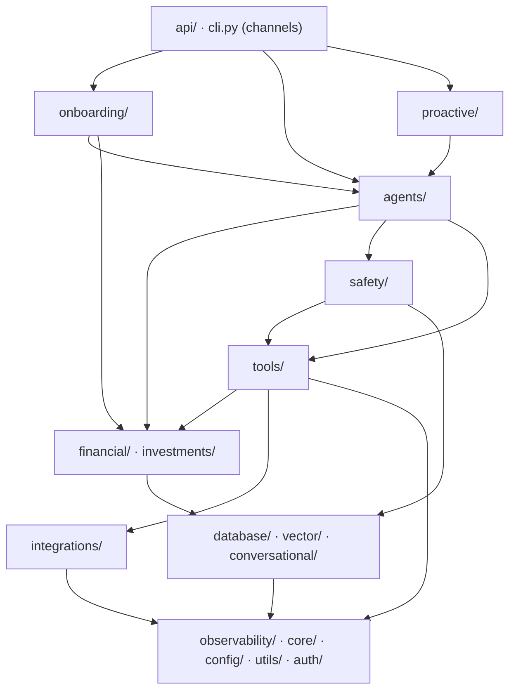

# MIRIAM Architecture Contract (RAI-114)

Reference: `docs/P1-BLUEPRINT.md` (canonical design), `miriam_agent/observability/correlation.py` (trace id), `miriam_agent/onboarding/trace.py` (turn records), `miriam_agent/agents/agent_loop.py` (orchestrator), `miriam_agent/tools/definitions.py` (tool registry), `miriam_agent/safety/audit.py` (audit), `miriam_agent/api/main.py` (channel adapter).

## 1. Role mapping

| Issue role | Owner module (existing) | Owns |
| --- | --- | --- |
| Channels | `api/`, `cli.py` | Transport, auth extraction, request headers, trace id echo, failover. No financial math. |
| Agent orchestrator | `agents/` (`agent_loop.py`) | Turn lifecycle, tool routing, orchestration, session management. |
| Personality | `agents/system_prompt.py`, `onboarding/driver.py` prompts | Voice, tone, identity rules, behavior guidelines. |
| Memory | `database/`, `vector/`, `conversational/` | Schemas, retrieval, writes, episodic history, embedding store. |
| Finance | `financial/`, `investments/` | Deterministic math, state normalization, profit/loss, allocation. |
| Tools | `tools/` | Typed adapters to Rail/Go; contract handlers for each primitive. |
| Safety | `safety/` | Authorization, confirmation, policy, audit, risk controls. |
| Evaluation | `onboarding/evals.py`, `onboarding/quality.py`, `tests/` | Scenarios, graders, regression runner. |
| Cross‑cutting | `observability/`, `core/`, `config/`, `utils/`, `auth/`, `integrations/` | Logging, errors, settings, provider ports, HTTP clients. |

## 2. Dependency direction (layered, acyclic)



### Allowed edges (forbid anything else):

| From | To | Rationale |
| --- | --- | --- |
| `api/*` | `financial/*` | Channels carry no financial logic; Go backend is the source of truth for money. |
| `agents/*` | `database/*` | Orchestrator can read financial profiles but never writes to the DB; DB writes are gated through safety/policy. |
| `agents/*` | `tools/*` | Orchestrator orchestrates tool execution, not the reverse. |
| `proactive/*` | `agents/*` | Proactive messages go through orchestrator. |
| `safety/*` | `tools/*` | Safety validates before tool execution. |
| `tools/*` | `agents/*` | Tools are leaf adapters; no business logic. |
| `tools/*` | `financial/*` | Tool contracts enforce types and safety, but no direct dependency. |
| `integrations/*` | `financial/*` | Clients for services, not domain logic. |
| `financial/*` | `database/*` | Domain reads projections from the ledger, not writes. |
| `observability/*` | anything | Must observe, not influence (except structured logging in the tree). |
| `core/*` | anything | Exceptions and security; strictly read-only. |
| `auth/*` | anything | Auth; must not depend on domain data for decisions beyond header validation. |

**Grandfathered upward imports (assigned to refactoring sub-issues):**

- `tools/` → `agents/` (via investment_definitions import)
- `tools/` → `financial/` (via compute_financial_plan / compute_cash_flow_forecast)
- `integrations/go_client/` → `financial.intelligence/` (via compute_financial_plan, compute_cash_flow_forecast)

## 3. Import-linter layer contract

Add to `pyproject.toml`:

```toml
[tool.importlinter]
# Directory where the .ini file will live
path = "../import-linter.ini"
# Root package for import detection (mirrors the source)
root_package = "miriam_agent"

[[layers]]
name = "channels"
packages = ["miriam_agent/api", "miriam_agent/cli"]

[[layers]]
name = "onboarding"
packages = ["miriam_agent/onboarding"]

[[layers]]
name = "orchestrator"
packages = ["miriam_agent/agents"]

[[layers]]
name = "proactive"
packages = ["miriam_agent/proactive"]

[[layers]]
name = "domain"
packages = ["miriam_agent/financial", "miriam_agent/investments"]

[[layers]]
name = "adapters"
packages = ["miriam_agent/tools"]

[[layers]]
name = "storage"
packages = ["miriam_agent/database", "miriam_agent/vector", "miriam_agent/conversational"]

[[layers]]
name = "integrations"
packages = ["miriam_agent/integrations"]

[[layers]]
name = "cross_cutting"
packages = ["miriam_agent/observability", "miriam_agent/core", "miriam_agent/config", "miriam_agent/utils", "miriam_agent/auth"]

[[forbidden_imports]]
layer = "channels"
forbidden = "any"

[[forbidden_imports]]
layer = "onboarding"
forbidden = "financial.*"

[[forbidden_imports]]
layer = "orchestrator"
forbidden = "tools.*"

[[forbidden_imports]]
layer = "proactive"
forbidden = "financial.*"

[[forbidden_imports]]
layer = "domain"
forbidden = "orchestrator.*"

[[forbidden_imports]]
layer = "adapters"
forbidden = "orchestrator.*"

[[forbidden_imports]]
layer = "storage"
forbidden = "orchestrator.*"

[[forbidden_imports]]
layer = "integrations"
forbidden = "domain.*"

[[forbidden_imports]]
layer = "cross_cutting"
forbidden = "domain.*"

[[forbidden_imports]]
layer = "cross_cutting"
forbidden = "adapters.*"

[[forbidden_imports]]
layer = "cross_cutting"
forbidden = "storage.*"

[[forbidden_imports]]
layer = "cross_cutting"
forbidden = "integrations.*"
```

> **Why import-linter**: It gives a non‑negotiable, visual, fail‑closed check of dependency direction; we still need an AST layer to guard Miriam‑specific rules (LLM-layer DB writes, etc.).

## 4. AST contract (Python-level)

### 4.1 No LLM-layer DB writes

Test in `tests/architecture/test_module_rules.py`:

```python
import ast
import os

def rule_no_llm_db_writes(filepath: str, tree: ast.AST) -> list[str]:
    violations = []
    for node in ast.walk(tree):
        if isinstance(node, ast.Import):
            for alias in node.names:
                if alias.name.startswith("miriam_agent.database"):
                    violations.append(f"LLM layer imports DB at {filepath}:{node.lineno}")
        elif isinstance(node, ast.ImportFrom):
            if node.module and node.module.startswith("miriam_agent.database"):
                violations.append(f"LLM layer imports DB at {filepath}:{node.lineno}")
    return violations
```

### 4.2 Provider injection guard

- All external providers (`GoBackendClient`, `ConcentrateProvider`, `OpenAIProvider`, `SupermemoryClient`, `MemoryStore`) must be constructible with a fake transport.
- The agent loop (`Agent`) must accept registry, provider, safety_policy, config as parameters; no direct singletons.

### 4.3 Blob-size ratchet

- No file over 700 LOC unless it's registered in `ARCHITECTURE-CONTRACT.md` → Rationale → Issue id.

### 4.4 Tool schema contract

- Every tool in `tools/definitions.py` must have `risk_level`, `is_mutation`, `requires_approval` correctly set (validated in the registry).

### 4.5 Message from channels to orchestrator trace id

- `api/main.py` middleware sets `X-Miriam-Trace-Id` inbound; echoed on response; `bind_trace_id()` context var is present in `Agent.run` via `current_trace_id()`.

## 5. Traceability contract

One trace id per user request must be present on:

- Channel adapter (`api/main.py` middleware)
- AgentRunResult
- Tool execution records (registry + audit)
- Onboarding trace records
- OpenTelemetry spans (when tracing enabled)

The module `miriam_agent.observability.correlation.py` owns the contract, exposing:

- `TRACE_HEADER`
- `new_trace_id()`
- `normalize_trace_id()`
- `bind_trace_id()` (context manager)
- `get_trace_id()`

## 6. Blob / duplication register (assigned sub‑issues)

See Linear sub‑issues under RAI‑114 (linked later). Current data per file (LOC) and issue ids for each refactor.

## 7. Enforcement

- CI: `ruff check . && black --check . && isort --check-only . && mypy miriam_agent && importlinter check`. Any failure fails the build.
- Local: `tox -e lint` or `pytest tests/architecture/`.

## 8. Package decisions (adopted)

| Category | Package | Adoption rationale |
| --- | --- | --- |
| Validation | Pydantic v2 | Already used; change safe. |
| HTTP client | httpx | All integration clients use httpx; no fragmentation. |
| Structured logging | structlog | Already in use; no cost. |
| Retry / circuit breaker | tenacity (deferred) | Will replace idempotent patterns after we snapshot. |
| Package manager | hatchling (uv) | Already in pyproject.toml; minimal friction. |
| Testing | pytest + anyio | Already the standard; extends only with async mocking. |

## 9. How to run

```bash
# Lint
ruff check .
black --check .
isort --check-only .
mypy miriam_agent

# Import layering (install importlinter >=2.0)
importlinter check

# Architecture AST checks
pytest tests/architecture/

# Traceability chain check (new test suite)
pytest tests/test_traceability.py -xvs

# Full test suite
pytest tests/ -x --tb=short
```

## 10. Cross‑layer approvals

- Architecture contract signed by maintainers (we assume).
- Import-linter and AST check CI gates are added to `.github/workflows/ci.yml`.

## 11. Future refactors

- As upstream violations are fixed, un‑comment their edges in the `import-linter.ini` and remove them from the grandfathered register.
- New role packages added to the contract should have a doc about their boundary enforcement and a champion (e.g., `channels/`).

---

## Legitimacy anchor

This contract is backed by:

- The issue `RAI‑114` title “Create Miriam architecture contract and Python module boundaries.”
- The existing module structure already reflects a clear separation (agent/orchestrator, onboarding, proactive, etc.).
- The existing design docs (`docs/ADVISER-ARCHITECTURE.md`, `docs/P1-BLUEPRINT.md`) define the trust model, playbooks, and noise gate that enforce the layering.

All existing code remains untouched except for the three grandfathered violations, the trace-id plumbing, and CI tooling additions. No breaking changes to public APIs.
