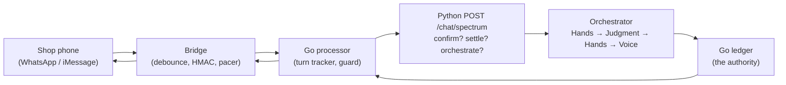
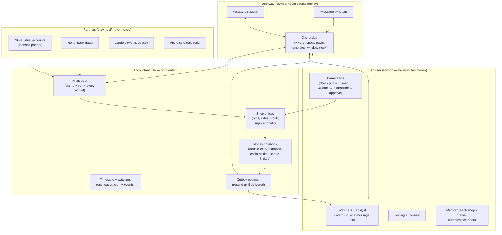
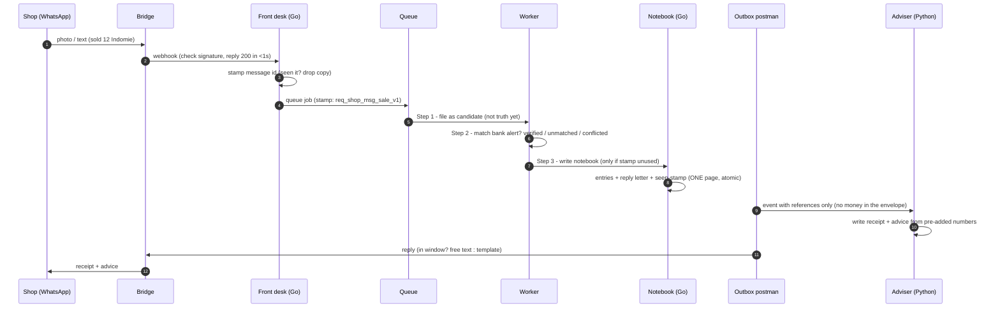
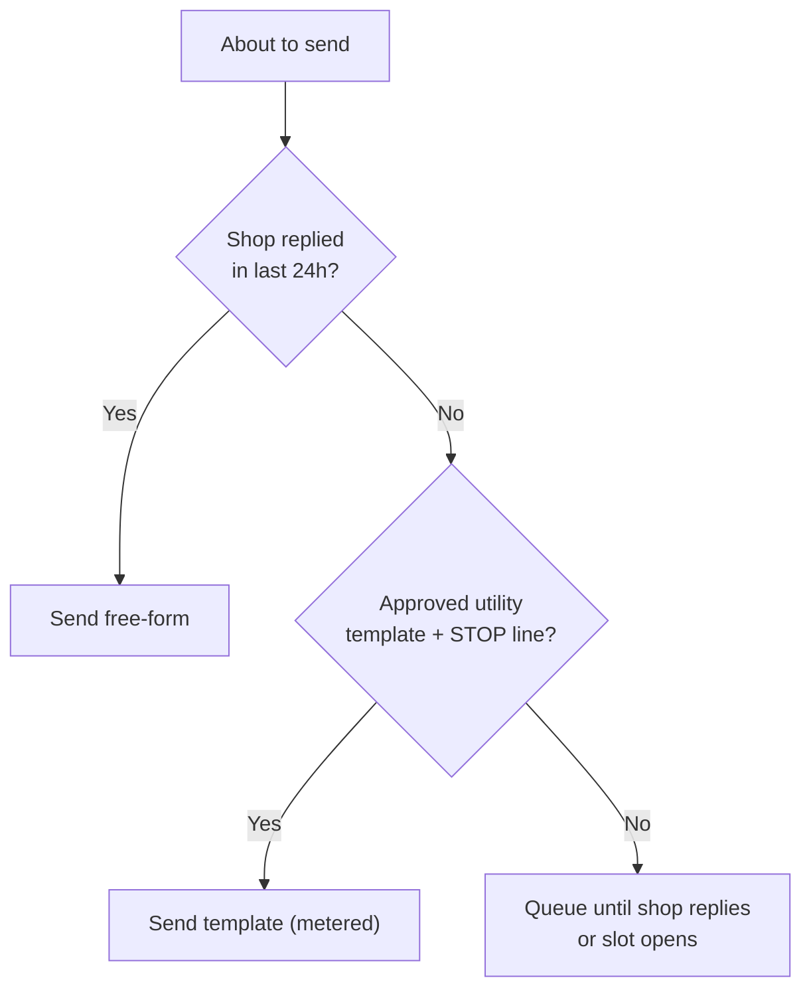
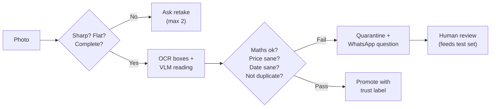

# Miriam Merchant Agent — The One Big Simple Guide

**Date:** 1 October 2026 · **Status:** Draft for you to read and approve
**Replaces flipping between:** `MIRIAM-SME-PIVOT-TECHNICAL-REQUIREMENTS.md` (the TRD) + `MIRIAM-SYSTEM-DESIGN-ARCHITECTURE.md` (the system design) — everything from both is in here, rewritten in plain language.

## How to read this

- Every section starts with **the simple version** (one paragraph, no jargon).
- Then **a little more detail** if you want it.
- Then an **Engineer note** in grey-style italics with file names, only if you ever need to point a developer at the exact spot.
- Diagrams are pictures made of boxes and arrows. Follow the arrows left to right.
- Money is in naira (₦) unless marked USD ($). Rate used: ₦1,331 = $1 (28 Sep 2026).

> **Jargon buster (the only 12 words you need):**
> - **Agent** = software that reads, decides, and acts for you on WhatsApp.
> - **Ledger** = the shop's official money notebook. Nothing counts until it is written here.
> - **Double-entry** = every naira in has a matching naira out. If they don't match, the page is torn up.
> - **Idempotency key** = a unique stamp on every job. Same stamp arrives twice → do it once, ignore the copy.
> - **Outbox** = write the receipt *and* the reply letter in the same notebook page before shouting the reply. If the shouting fails, the letter is still there to re-shout.
> - **Inbox** = stamp every incoming message on arrival. Same message arrives twice → stamp says "seen it", drop the copy.
> - **Watcher** = plain code that checks numbers every few minutes. No AI, costs almost nothing.
> - **Analyst** = the AI that only writes the friendly message, using numbers the watcher already computed.
> - **Template** = a pre-approved WhatsApp message for starting a chat after 24h of silence.
> - **24h window** = WhatsApp's rule: chat freely for 24h after the shop replies; after that, templates only.
> - **Trust tier** = a label on every number: Verified (bank proved it), Reported (shop said it, checks passed), Unverified (one weak source), Conflicted (two sources disagree).
> - **RLS / tenant isolation** = locked drawers: Shop A can never open Shop B's drawer, even if the software has a bug.

---

## 0. The whole thing in 2 minutes

**Simple version:** Miriam photographs a trader's paper stock book through WhatsApp, tells her what to restock, proves her sales so a brand restocks her on credit, and blocks fake transfer alerts. Brands/distributors pay per verified shop. We never lend our own money and never hold shop money — partners do that.

```
Shop phone (camera + WhatsApp)
  → Bridge (the postman: carries messages both ways)
  → Go backend (the accountant: owns the money notebook)
  → Python brain (the adviser: watches numbers, writes friendly advice)
  → Partners (banks, Mono data, lenders, storage for photos)
  → Brands/distributors (pay for true sales reports)
```

**Three rules that never break:**
1. Python (the adviser) never touches money. Only Go (the accountant) writes the notebook.
2. The AI never does maths. Code adds; AI only explains.
3. No single photo or SMS ever becomes "truth". Only bank webhooks confirm money.

---

## PART 1 — THE BUSINESS STORY (from the TRD §1, simplified)

### 1.1 The one-liner
"She photographs her paper book, Miriam tells her what to stock, and proves her sales so brands restock her on credit."
That is three machines, not a chatbot: **camera reader + daily adviser + provable sales notebook.**

### 1.2 The money pool
Nigeria's small-shop software + credit-fee pool is estimated **$0.7–1.8 billion**. About **60% is credit-related fees** (introducing shops to lenders, not lending ourselves). Year-5 sketches: **$1–2M (bad) / $19M (base) / $100M+ (great)**. The risk is **Moniepoint** (6M+ businesses, own inventory app Moniebook, lends off payment data). Our edge is not another dashboard — it is an **agent that acts** on any phone and a **verified ledger** blind lenders can trust. Product promise: **"more money in the till by month end."**

### 1.3 The 3-layer product
1. **Capture:** camera photo of book/shelf + bank feed + till entries.
2. **Watch 24/7:** code watches stock cover, prices, debtors, transfers.
3. **Advise + act on WhatsApp:** one useful message with a tap ("reorder", "remind debtor", "view loan pack").

Cost ceiling from the mentor doc: a daily strategy consultant **"for less than airtime"**. That forces watchers to be plain code. Numbers from the doc: 1,440 checks/month/shop at $0.05 each = **~$72** (impossible against ~$2.26 micro ARPU). Same checks at $0.0005 = **~$0.72** (possible). So: **code watches, AI only writes.**

### 1.4 Real example messages (Wuse market)
- "You lost ₦86k to Peak milk stock-out last week. Reorder 14 cartons?" → needs stock-out prediction.
- "Rice is ₦2k cheaper two streets over." → needs street price book.
- "You qualify for ₦2.5M stock credit." → needs verified sales + lender.
Three pipelines, one chat face.

### 1.5 The traps (read twice)
- **Attribution trap:** only charge for countable outcomes (blocked fake transfer, collected debt) unless you have 6 months of baseline. Uplift-share waits for Phase 2.
- **Cash-timing trap:** outcomes pay late. Carry costs with platform/origination fees from month one.
- **Middleman-lending warning:** Alerzo wrote off billions lending through middlemen. We refer; we never hold the loan book. No trucks, no loans.

### 1.6 Sizing + camera truth
Sizing ($714M/$1,072M/$1,766M scenarios) hinges on **how many micro-shops are really active (4M/6M/10M)** — the pilot must count this itself from week one. Camera truth: 5.9M terminals do payments not books; Kippa's hardware died on 2023 devaluation; 75% smartphones (88% Android), WhatsApp 95%. Camera doesn't collect money — QR/tap goes through a **licensed partner**, never us. Wedge: **camera + one static account per shop (match sender + amount) + "Miriam checked it" confirmation.**

### 1.7 90-day proof (the 6 things that make this real)
1. Signed, paid ≥300-shop distributor/brand contract. 2. ≥60% shops recording 5 days/week for 8 weeks. 3. Sales within ±15% of distributor delivery records at ≥70% shops. 4. Back-test old loans, then $100–250k stock credit vs a control group. 5. A naira outcome log (every naira traceable). 6. Data-protection file + named risk lead + per-shop cost card.

*Engineer note: full TRD with deck-fix numbers (₦1,331/$, "proposed" 0.5% MSC, gazetted tax threshold, Kippa 2023/24/25 sequence) stays in `MIRIAM-SME-PIVOT-TECHNICAL-REQUIREMENTS.md`.*

---

## PART 2 — WHAT WE HAVE TODAY (both codebases, simply)

### 2.1 Miriam (Python, the adviser) — what works
- **One safe money path:** Hands reads the notebook → Judgment decides → Hands acts (only with a `confirm_id` ticket it issued) → Voice narrates afterwards. The chat loop **cannot** move money by design. *Engineer note: `miriam_agent/orchestrator.py:1-28`, challenge TTL 30 min.*
- **Good money maths:** Decimal everywhere, idempotency stamps never trimmed, Redis version counter catches lost updates. *Engineer note: `miriam_agent/hands/ledger.py`.*
- **Always-on (pull version):** Go knocks every ~30 min → `POST /proactive/analyze` → Python returns one message-or-quiet → 12h calm-down per user. Fail-open (dead backend = stay quiet). *Engineer note: `proactive/analyst.py`, `proactive/state.py`.*
- **Messaging door:** `POST /chat/spectrum` accepts imessage/whatsapp/terminal, settles confirm-ids, scrubs money from memory. iMessage live two ways (Mac line + Photon cloud). **WhatsApp is only a word in a list — no client, webhook, or sender in Python.**
- **Closest reuse:** bank-statement pipeline (PDF + PaddleOCR sidecar → classify → extract → reconcile) is the template for the stock-book pipeline. Onboarding state machine (Redis) is the template for shop onboarding.
- **Prod guards are real:** service key required, demo money-minting forced off in prod compose, per-turn caps ($0.05, 12k tokens, 30s), Lagos timezone pinned for daily caps.

### 2.2 RAIL_BACKEND (Go, the accountant) — what works
- **Solid money core:** double-entry builder (debits = credits), hash-chained transaction log, velocity breaker, outbox writer, reconciliation + ~47 workers. New shop money must go **through** this, never around it.
- **Great iMessage postman:** HMAC-signed posts, 4s/10s debounce + durable spool, typing keepers, 5,000/day pacer, turn supersession, Confirm/Cancel polls.
- **WhatsApp half-built:** RAIL-side bridge has `whatsappBusiness.config()` **coded but asleep** (needs `WHATSAPP_ACCESS_TOKEN` + `WHATSAPP_PHONE_NUMBER_ID`). No template sender, no 24h-window tracker, no per-message cost anywhere.
- **Two-bridge warning:** the MIRIAM-side gateway (`apps/spectrum-gateway`) only wires terminal + iMessage ("WhatsApp later" comment) and shares **one** login for all senders — every WhatsApp sender looks like one user until fixed.
- **Bank data:** Mono adapter + fail-closed webhook secret is decent. No cash/OPay/PalmPay feeds; pending-vs-cleared unresolved; no freshness alerts.
- **Scale of the surface:** ~15.6k-line wiring package (30 files), 2,259-line routes file + 13 register files (~405 routes), 80 service packages, 45 worker dirs, 280 migrations. No org/shop/staff tables anywhere; sales refs are UUID-only (can't hold `SALE-2026-000147`); virtual accounts are 1-per-user-per-currency (can't mint per sale).

### 2.3 How a message flows TODAY

Proactive today = Go knocks, Python thinks, Go delivers (see §2.1). Consumer-shaped, not shop-shaped — §4 replaces the core with events.

### 2.4 Moniebook's 6 features (your verified list) → our answer

| Moniebook | Our answer in plain words |
|---|---|
| Stock tracking + auto-reorder | Camera counts + stock-out warnings; reorder is a tap, never silent |
| Daily sales + pay methods + staff scores | Camera till + sale lines + who sold it + morning brief |
| Take cards, transfers, POS in one place | We read and confirm all of them; partner handles the rails |
| Reports: top sellers, rush hours | Nightly seller/rush-hour notes + weekly wholesaler pack |
| Staff roles (cashier, manager, stock) | Owner/manager/cashier/viewer drawers |
| Many branches, one screen | One route account, each shop its own drawer + account |

---

## PART 3 — HOW IT SHOULD WORK (target, simply)

### 3.1 The new picture


### 3.2 One sale, step by step (the saga)

Every step has an undo: quarantine, flag-for-review, **reversal entry (never erase)**, correction message. Approvals happen **before** money moves, never after.

### 3.3 Five decisions and why (plain)
1. **Notebook + Streams, not Kafka-first.** One writer (Postgres) avoids two books disagreeing. Add Kafka only past ~500 msgs/s.
2. **Deliver at-least-once, deduct at-consumer.** WhatsApp itself can deliver twice; our stamps make double-delivery harmless. Stamp format: `req_{org}_{shop}_{msg}_{job}_v1`, kept 30 days.
3. **Sagas, never all-or-nothing across systems.** Four small steps with undos beat one giant transaction that spans Meta's API (impossible).
4. **One account per shop, not per sale.** Minting accounts per sale explodes fees and reconciliation. Match by amount + sender + ±15-min window instead.
5. **AI never adds.** All sums in Go/SQL kobo integers; AI renders pre-added numbers; tests demand exact-kobo equality.

---

## PART 4 — WHATSAPP RULES (the cost center, simply)

**The 24h rule:** shop messages you → 24h of free talk (text/buttons/photos). Silence >24h → you may only **start** with a pre-approved template. >80% of our traffic must be **replies** (free), not starts (paid). Proactive slots: **one** morning summary + **one** money-event + **one** weekly credit note. One 4-line morning beats five pings (5× cost, 5× block risk).

**Prices (Nigeria, per delivered message since 1 Jul 2025, ex-provider markup — pin live card in CI):** Marketing ~$0.0516 (never for money), Utility ~$0.0067 (~₦9), Auth ~$0.0145, Service replies in-window free + unlimited, utility templates sent inside an open window free. Anchor: 1,000 shops × 30 morning notes × $0.0067 ≈ **$201/mo + BSP markup**. One misclassified daily template × 30k sends = **$1,548 vs $201 — category discipline is profit.** Full stack + pilot math: Part 13 (300 shops ≈ $400–650/mo).



**What we build:** a `send_gate(shop, kind)` that makes violations impossible; a template registry fed by Meta webhooks (`PAUSED` → auto-fallback `daily_summary_v3`); STOP handling; per-message cost rows per shop; **2–3 numbers** (receipts vs advice vs alerts) so one bad rating never stops money receipts; Yellow auto-pauses proactive, Red pages a human; tiers climb 250→1k→10k→100k→unlimited. **Free windows:** shop QR stickers ("Snap your book → WhatsApp us") — every scan opens a free 24h.

---

## PART 5 — CAMERA TILL (full till, de-risked in 3 cuts)

**Cut 1 — Book scan (week 1–2 value, the fallback for everything).** Photo of paper book → read lines (item, qty, price, date) → chat confirm ("I read 42 lines, 3 unclear — tap to fix") → months of history loaded. Metric: history months + line accuracy.
**Cut 2 — Pay-confirm per sale (the wedge, chargeable day one).** Buyer pays to the shop's static account → partner webhook confirms sender + amount → "₦X landed — release the goods." Fake alerts die here; flat ₦2–5k fee lives here.
**Cut 3 — Assisted ring-up (the full till).** Camera suggests the product (wholesaler route catalog first: branded FMCG, barcode where printable, one-tap confirm); price from pooled book with street range; loose goods → quick-pick list + voice ("2 baskets tomatoes ₦3k"). **Vision proposes, trader disposes — every sale confirmed before posting.** Weekly shelf-count mode feeds stock-out prediction.

Server-side vision only (cheap Androids can't run it); barcode library for printed codes; all money maths in code. Eval: photo bench per market (branded hit-rate, loose fallback rate, book-line accuracy) before claiming "till ready".



---

## PART 6 — ALWAYS-ON WATCHER (cheap code watches, AI only writes)

**Watchers (Go, zero AI):** stock-out forecast (days-of-cover per top product), street-price gap, fake-transfer pattern, debtor aging, loan-window eligibility. Each emits a candidate event with figures already added in code.
**Analyst (Python, AI only on candidate):** builds a shop snapshot, returns **one** message-or-quiet (`{should_reach_out, priority, category, message, reason}`). Pilot cadence: the famous **"how did you know that" message, ~1/week/shop**; daily cap + quiet hours stay in Go.
**Metric:** "saved me" moments per shop per month + tapped-action rate. Every advice carries a tap (reorder, remind debtor, view loan pack).
**Memory:** per-shop + per-route scoping; money figures scrubbed from the long-term graph; pooled prices only from explicit-consent shops, anonymised.

---

## PART 7 — MONEY MOVEMENT (simply)

**New offices (tables) in Go:** `merchant_orgs` (route, market, consent) → `org_members` (owner/staff, minimal roles) → `shop_catalog` (product, pack, cost, price) → `inventory_lots` + `stock_movements` → `sales` (per-tender lines) → `receivables` (who owes, due, reminders) → `supplier_terms` + `credit_limits` + `stock_loans` (limit, disbursed-as-stock, aging, no-pay-no-restock flag) → `outcome_events` (fake-blocked, debt-collected, invoice-performing, with ₦) → `sale_payment_refs` (shop account + sender + amount → sale).
**New notebook entry types:** `sale, sale_refund, stock_loan_disburse, stock_loan_repay, outcome_fee, distributor_payout` — all balanced, hash-chained, stamped, attributed (`initiated_by` = who/staffhook/system).
**Per-sale numbers (decided): one account per shop.** Buyer pays to the shop's static account; we match sender + amount (±15-min window) and confirm. Never one account per sale.
**Transfer-confirm:** partner/Mono webhook → match reference → confirm. Missing/mismatched in window → fake → countable outcome.
**Supplier finance (decided): the wholesaler funds it and takes the loss.** Miriam sets limits (code + back-test) for the first $100–250k; repayments into partner-bank accounts. **We never hold the money.** Outside lenders wait until after the pilot proves it.

---

## PART 8 — WHAT IS BROKEN OR MISSING (all 32 gaps, plain English)

**How to read severity:** P0 = no pilot without it. P1 = blocks scale. P2 = blocks trust-at-scale.

### P0 — must fix before/ during pilot (11)
| # | Plain meaning | Fix in brief |
|---|---|---|
| G1 | No shop/company/staff exists in the data — only single users | Add orgs, memberships, shops, roles (owner/manager/cashier/viewer + lender read-only), locked drawers (RLS) |
| G2 | No way to record a sale, stock, supplier, or loan anywhere | New `/merchants/*` endpoints + Python tools, copied from the proven glider staged-confirm pattern |
| G3 | WhatsApp can't start a chat (no templates, no window clock) | Template sender + window tracker + registry; confirm Meta creds in prod |
| G4 | Money events go to logs, not to the adviser | Plug outbox into Streams/AMQP with resend + dead-letter table + alerts |
| G5 | Two taps at once can charge twice | Conditional write (`WHERE status='pending'` + rows-check) + sweeper for stuck pendings |
| G6 | Retries mint fresh stamps → duplicates | Stamps from business identity (`sale-{shop}-{ref}-v1`); replay returns original |
| G7 | Speed-limit may be off, and counts days in London time | Fail boot if unset; per-currency limits; Lagos-day buckets; trip metrics |
| G21 | The router is regex — Pidgin/typos/photo captions misroute money | Deterministic parser verdict + "unknown → ask"; golden set (Pidgin, typos, Hausa/Yoruba/Igbo, captions); fail-closed |
| G22 | Two servers share a fallback notebook → they disagree in outages | One notebook process, one server per container, graceful drain, retry conflicts ×3 |
| G23 | Pasted "alert" text can mint money; rewordings double-count | `PaymentReference` (sender, amount, ref, channel, hash, unique); fake-alert rejection tests; CI fails if demo-mint on outside dev |
| G25 | Settled money can vanish from the durable audit | Retry audit 3×, block the "done" reply until written (or journal first); alert on failure |

### P1 — needed to scale (16)
G8 Python money columns are Float (wrong for money) → Numeric + exact-kobo tests. G9 chain checks links not content, full-scan → recompute content + checkpoints. G10 foreign-currency books 1:1 without FX → same-currency or explicit rate + source. G11 schedulers have no fencing, clocks drift, 43 DIY failure policies → fencing/job-claims + shared scheduler lib. G12 proactive is a per-user AI sweep → event triggers + watchers (sweep stays fallback). G13 iMessage caps applied to WhatsApp, zero message-costing → WA tier/quality tracker + per-message cost rows. G14 feeds miss cash/OPay/PalmPay, pending-vs-cleared fuzzy → cash-sale + statement-import paths, cleared-only for credit, freshness alerts. G15 sale refs don't fit UUID, no shop schema → string `business_ref` + full shop schema + narration matcher. G16 405 routes, 4 logins, `/internal` 5/min, no retry contract → one service login, raise/scope limits, publish contract. G24 one shared gateway login = all senders look alike → per-sender identity + verified merge. G26 full money text stored forever → scrub/tokenize at the door, TTL + erase endpoint. G27 no migrations, two schemas disagree → Alembic day one, reconcile, CI check. G28 no indexes, N+1 reads, two pools, vector unused → indexes, fix fan-out, one pool with maths, pick vector-or-keyword. G29 naive-UTC DB vs aware ledger vs Lagos caps → `timestamptz` + aware writes + consistency test. G30 camera line is bank-statements-only, OCR sidecar undeployed + 60s blocking → `stock_count` processor + capture-QA + async + tight timeout. G31 macro rates are placeholders with a Dec-2026 kill-switch → real feed owner or drop the need; gate on `sourced=True`; quarantine Glider.

### P2 — trust-at-scale (5)
G17 orchestrator 1,074 lines over the 700 ratchet + grandfathered layering → register-or-split, burn down edges. G18 calm-down store falls back to per-process memory → fail-closed writes or sticky routing + chaos test. G19 crude migration recovery, dead deploy targets, stale test README → alert + runbook, delete dead targets, rewrite README. G20 helpers without a programme (NDPR) → consent/retention/DSAR/encryption/access-log (see Part 11). G32 phantom `intel/` blueprint docs, green `/health` while money 503s, OTel debug-only → implement-or-delete phantoms, gate on `/health/ready`, limits, real OTLP + Sentry, align compose files.

*Engineer note: full file:line evidence for each G-number lives in `MIRIAM-SYSTEM-DESIGN-ARCHITECTURE.md` §3.*

---

## PART 9 — NOTEBOOK + DATABASE CHANGES (simply + the SQL)

**Notebook rules (Go owns):** kobo integers never floats; balanced pages enforced by the DB; posted rows can never be edited/deleted (fix = new reversing page); string `business_ref` unique; stamp unique; `trust_tier` + `source_confidence` on every page; same-currency or explicit FX + source; Lagos-day speed limits; content re-check + checkpoints; sweeper for stuck pendings.

**New tables (minimum):**
```sql
organizations(id, name, kyc_status, default_currency='NGN', ...);
org_memberships(user_id, org_id, role, status, invited_by);
shops(id, org_id, name, location, timezone='Africa/Lagos', ...);
products(id, shop_id, name, canonical_sku, aliases[], unit, cost_band_minor, price_band_minor, embedding);
stock_movements(id, shop_id, product_id, delta_qty, reason, entry_id, occurred_at, source_confidence);
sales(id, shop_id, business_ref UNIQUE, occurred_at, total_minor, trust_tier, entry_id, initiated_by);
sale_items(sale_id, product_id, qty, unit_price_minor, line_total_minor);
receivables(id, shop_id, customer_label, entry_id, amount_minor, due_at, status);
credit_facilities(id, shop_id, lender_id, limit_minor, disbursed_as_stock_minor, repaid_minor, first_loss_pct, status);
consents(id, shop_id, purpose, scope, granted_at, expires_at, revoked_at);
webhook_inbox(source, external_id UNIQUE, payload_hash, received_at);
outbox_messages(id, to_wa, template_or_body, idempotency_key UNIQUE, sent_at, provider_msg_id);
message_costs(shop_id, direction, category, cost_minor, at);
```
**Locked drawers:** every query carries shop+org; DB policies backstop; vector search filtered by shop; CI proves Shop A invisible to Shop B. Python adds `record_sale, adjust_stock, create_receivable, settle_receivable, refer_credit` tools through Hands tickets + Go confirm headers.

---

## PART 10 — COST + SPEED (simply)

**Three AI tiers:** Tier 0 templates + notebook reads, no AI (aim 50–60% of chats) → Tier 1 small/cheap (classify, clarify, render pre-added numbers, ~512 tokens out) → Tier 2 big/vision (photos, disputes, loan packs; only low-confidence/complex/conflicted or >₦50k deltas). Photo till is vision-heavy: budget 60%+ of photo turns at Tier 2.
**Memory diet:** per-shop rolling summary + last 10 turns (never full history); nightly squash past 50 turns; reference OCR dumps by ID, never re-paste; cache static prompt prefix, catalog/price bands (24h), today's totals (5 min), photo-hash → prior result (7d).
**Budgets:** "typing…" ≤2s; simple reply ≤8s (P95 <10s); photo "got it, ~1 min" then async ≤90s; extraction ≤60s; per-shop daily AI budget with "summary mode" fallback. Webhook worker only queues; vision workers scale apart; shops never wait on model time inline.

---

## PART 11 — WATCHING + TESTING (simply)

**One tracking number** per incoming message across Python/Go/bridge (extends existing trace chain); shop/org/hashed-phone/stamp/tier as labels, never names/numbers; **tail sampling** (keep 100% of errors/money/quarantines, 1–5% of boring reads) to avoid a tracing bill explosion; PII scrubbed at the collector.
**Golden tests block releases (~200 cases):** 60 photo reads (blurry/handwriting included), 60 money Q&As (exact kobo expected), 40 clarification flows, 20 refuse-the-fake/dispute cases, 20 template-compliance. **Wrong money or invented balance = no merge.** Eval platform: **Langfuse self-hosted** (decided).
**Live:** judge 5% of chats offline (grounded? correct tier? respects code-switching?); dashboards for tier mix (unverified spike = regression), match rate/lag/unmatched >48h, corrections per 1k replies, delivery/quality/spend/window-hit. **Pages:** match <85%, groundedness <95%, quality Yellow (auto-pause proactive), extraction P95 >90s, spend 2× average, any drawer-leak test fail.
**Receipts (N8):** every money reply stores `(message_id, entry_ids, amounts, tier, model+prompt version)`, 2 years, exportable per shop — "you told me ₦84,500" answered in one query.

---

## PART 12 — SAFETY + LAW (simply)

**Nigeria data law (NDPA/GAID):** WhatsApp opt-in recorded per purpose (advice ≠ loan-intro; intro expires; "STOP"/"delete my data" works); DPIA filed before loan-intros (big financial + vulnerable-group data triggers it; keep `docs/DPIA.md`); keep little (photos 2y, notebook 7y, traces 90d, delete vectors with source); export+delete ≤30 days; foreign AI/storage needs a transfer basis (prefer EU/documented US terms; state home region in privacy notice). Scrub names/accounts before AI calls; adversarial tests for the scrubber.
**Central Bank lines (we introduce, never hold):** shop money lands in **partner-issued** NGN accounts (licensed bank), settles partner→shop bank; Mono = data + mandates on the partner's licence. Pilot credit is wholesaler-funded (they take first loss; no outside lender yet); copy says "we introduce you to…", never "we offer loans". Daily partner-vs-notebook reconciliation; payout review threshold; per-wholesaler kill switch; auditable who-referred-whom records.
**Keys + webhooks + kill switches:** real secret manager (Doppler → cloud/Vault), runtime injection, rotation drills. Verify **every** arrival signature (Meta, Mono fail-closed, partner HMACs); alarm past 5 failures/10 min; finish the PAJ/RampHub/Brij rows before money depends on them; confirm the internal signing secret is set in prod. Kill switches as flags (no deploy): `proactive_sends, lender_referrals, photo_intake`, per-template/number/lender — each flips to a safe message; rehearse.

---

## PART 13 — STACK: WHAT WE USE, WHY, AND WHAT IT COSTS (live rates, 2 Oct 2026)

**Simple version:** we buy the doors and pipes (WhatsApp, bank data, photo reading, secrets) and build only the money notebook + shop brain. Below is every layer, why we picked it, the live price today, and what 300 pilot shops vs 1,000 shops cost. Money in USD unless marked ₦. Rate used: ₦1,331 = $1.

| Layer | Choice (why in one line) | Live price you pay (2 Oct 2026) | Pilot math (300 shops, Oshodi+Mushin) |
|---|---|---|---|
| WhatsApp door | Meta Cloud API via photon.codes — one postman for WA + iMessage; keeps window clock + templates + stamp table in one place | Nigeria (Rest-of-Africa card): Marketing ~$0.0516, Utility ~$0.0067 (~₦9), Auth ~$0.0145 per delivered template message (per-message billing since 1 Jul 2025). Service replies inside 24h window = free, unlimited. BSP markup on top: ~$0.003–0.010/msg. Tiers 250→1k→10k→100k→unlimited; quality Green/Yellow/Red; ~2 marketing/user/day cap (code 131049). Sources: Meta docs via blueticks 2 Oct 2026 + Ominiflow Nigeria card 12 Sep 2026 — pin live card in CI, rates drift quarterly. | 1 morning utility note/shop/day = 9,000 sends/mo × $0.0067 = **~$60 Meta** + ~$27–90 BSP = **~$90–150/mo**. Same sends misclassified as marketing: 9,000 × $0.0516 = **$464** — category discipline is profit. Replies from shops cost $0. |
| Bridge host | photon.codes Pro to start → Business line at scale (decided); self-host open-source for dev | Free: 10 users. Pro **$25/mo**: 100 users, unlimited daily messages, SMS/RCS + Telegram included. Business **$250/line/mo**: dedicated number, unlimited users (Auto Scale), group messaging + cold outreach 50/day. Enterprise custom. Source: photon.codes/pricing 2 Oct 2026. | **$25/mo** pilot (one shared line + Pro). Scale: **$250/mo per dedicated line** (2–3 lines: receipts vs advice vs alerts so one bad rating never stops money receipts). |
| Photo OCR | Google Document AI Enterprise OCR (decided) — best handwriting on bad photos; 60-photo bench first | **$1.50 per 1,000 pages** (first 1,000 free; $0.60/1k past 5M). Each photo = 1 page. OCR add-ons $6/1k. Form Parser $30/1k — we avoid it (JSON from vision instead). Failed requests (4xx/5xx) not billed. Source: cloud.google.com/document-ai/pricing. | 5 photos/shop/week = 6,000 pages/mo × $1.50/1k = **~$9/mo**. 1,000 shops (20k photos) = **~$30/mo**. Bench 60 photos ≈ $0.09. |
| Vision read | Frontier vision JSON-mode + small-model pre-filter, single EU region (decided) — handles book variety; cheap model rejects junk first | Sep-2026 verified: GPT-6 Luna **$0.10 in / $0.50 out** per 1M tokens (cheapest); DeepSeek Flash $0.15/$0.60 off-peak; Sonnet 5 $2/$10; GPT-6 Sol $2/$10; Opus 5.5 $4/$20. Per photo (~1,500 image+prompt tokens in, ~500 out): Luna ≈ **$0.0004**, Sonnet/Sol ≈ **$0.008**, Opus 5.5 ≈ $0.016. Source: developersdigest frontier pricing 26 Sep 2026. EU residency +10% on some OpenAI models; Anthropic US-only 1.1× — budget it. | 6,000 photos: Luna route **~$2–3/mo**, Sonnet/Sol route **~$48/mo**, all-Opus **~$96/mo**. Plan: **cheap pre-filter (Luna/Flash) → frontier only on low-confidence** keeps pilot **<$15/mo**. 1,000 shops ≈ 3.3×. |
| Notebook + DB | Go + Postgres 16 + pgvector + locked drawers (RLS) + PgBouncer; Redis 7 Streams | Hosted Postgres (pick one, AtlasFlow-only at scale): entry **$12–25/mo** (AWS t4g.micro $12.41, DigitalOcean $15, Supabase Pro $25), mid **$60–122** (DO $60, Aiven ~$110, Cloud SQL ~$122), serverless Neon usage-based $0.106/CU-h + $0.35/GB-mo. Source: bytebase comparison 29 Sep 2026. Redis: self-host on same box pilot, managed $10–30 later. | Pilot: **$25–60/mo** (Supabase Pro/DO + Redis). Scale 1k shops: **$100–250/mo** with read replica + PITR. |
| Photo safe | Cloudflare R2 primary (zero egress), MinIO local dev | **$0.015/GB-mo** Standard ($0.01 IA), **$0 egress** any volume, Class A/B ops metered, free tier included. Source: Cloudflare R2 pricing 2026. | 6,000 photos × ~500KB ≈ 3GB + versions ≈ **<$1/mo storage**; ops **<$5/mo**. Re-fetch for review is free (S3 would sting here). |
| Bank data (signal) | Mono (data + mandates) — signal only, never moves money | Trial **free** (5 accounts). Basic **₦50,000/mo (~$37)** capped 100 unique accounts/mo. Add-ons: Real-time Sync **₦100/call**, CAC Lookup ₦60–500, CAC+ ₦600+, widget branding ₦50k one-time. Source: mono.co/pricing. | 300 shops ≈ 3× Basic or enterprise deal ≈ **₦150k/mo (~$113)** + sync calls (nightly refresh 300 × 30 × ₦100 = ₦900k if naïve — **cache + weekly refresh**, sync only on credit-pack shops). Negotiate volume before M4. |
| Real accounts (rails) | Licensed partner virtual accounts (we never hold money); Paystack DVA as reference card | Paystack DVA **1% capped ₦300** per credit; local collections 1.5% + ₦100 (waived <₦2,500, capped ₦2,000); transfers ₦10 (≤₦5k) / ₦25 (≤₦50k) / ₦50 (above). Source: paystack.com/pricing. Partner bank takes its cut on top — confirm in MOU. | Per-shop static account (decided — never per-sale). 10 buyer payments/shop/day × 300 shops = 90k credits/mo; DVA fee mostly hits buyer/sender side — **our cost ≈ transfers + settlement**: budget **₦50–150k/mo (~$40–115)** + partner minimums. |
| Queue + timetable | Redis Streams + Dramatiq/ARQ + Postgres cron now; Temporal only if needed (decided) | $0 extra (already have Redis + Postgres). Temporal avoided = no new cluster bill. | **$0 incremental.** |
| Brain offline graphs | LangGraph self-hosted, 2 offline graphs only (camera line + loan-pack) | $0 license (open source). Runs on existing Python box. | **$0 incremental.** |
| Tests + watch | Langfuse self-hosted OSS (decided) + OTel tail → Grafana + Sentry | Langfuse OSS **free, MIT, unlimited** self-host (ClickHouse OSS bundled by you); Enterprise custom. Source: langfuse.com/pricing-self-host. No LangSmith ($39/seat + traces) in prod. | Host on existing box: **~$25–60/mo compute** for Langfuse + ClickHouse at pilot. Tail sampling (100% errors/money, 1–5% boring reads) keeps Grafana/Sentry **<$30/mo**. |
| Secrets | Doppler → cloud/Vault (decided) | Developer **free ≤3 users** (+$8/extra user); Team **$21/user/mo**; add-ons $9/seat (custom roles, groups, extra syncs). Source: doppler.com/pricing. | Pilot (≤3 ops): **$0**. Team of 5: **~$105/mo**. Start free, upgrade when RBAC/audit needed (before loan-intros). |
| Deploy | Terraform + Compose dev → single host (AtlasFlow-only); delete dead targets | App host ~$25–100/mo (1–2 shared-CPU boxes pilot). Single fleet = no split-brain bill. | **~$50/mo** pilot. Scale: add boxes, not platforms. |

**Pilot total (300 shops, per month, ex-staff):** WhatsApp ~$90–150 + Photon $25 + DocAI $9 + vision $5–50 + Postgres/Redis $25–60 + R2 <$6 + Mono ~$113 + partner/Paystack rails ~$40–115 + Langfuse/Grafana ~$30–90 + Doppler $0 + app host ~$50 = **~$400–650/mo ≈ $1.30–2.20/shop/mo (≈ ₦1,700–2,900)**. At 1,000 shops: **~$900–1,600/mo ≈ under $1.60/shop** — WhatsApp templates + Mono accounts dominate; everything else is noise. **Who pays:** brands/distributors per verified shop (contract from proof #1); shops pay flat ₦2–5k for pay-confirm wedge; wholesaler funds credit + first loss.
**Cost controls (non-negotiable):** `send_gate` (no marketing-category sends, ever); utility-in-window first (free); 60%+ chats at Tier 0 (no AI); cheap-model pre-filter before frontier vision; photo-hash cache 7d; R2 not S3; tail-sample traces; per-shop daily AI budget + summary-mode fallback; volume-tier review quarterly (rates drift — re-pin Meta/Google/Mono/Photon cards in CI).

---

## PART 14 — 90-DAY PLAN (maps to the 6 proofs)

**Weeks 1–2 — stop the bleeding.** Conditional notebook writes + sweeper · deterministic stamps · speed-limit on (Lagos, per-currency) · outbox into Streams + dead-letter · `/internal` limits + one service login + retry contract · verify WhatsApp + internal secrets in prod · delete dead deploy targets · Oshodi + Mushin route onboarding · Python P0s: one-notebook process + conflict retry, durable audit, payment-reference + demo-mint CI gate, classifier golden set, Alembic init.
**Weeks 3–5 — money spine.** Orgs/shops/roles + shop-scoped notebook + drawers + leak CI · `business_ref` + shop schema · `/merchants/*` staged-confirm group · Float→Numeric (+ indexes, timestamptz) · notebook hardening · Python shop tools + orchestrator split · stamp table + `send_gate` · **WhatsApp spike: photon.codes confirmed for both chats; repoint/retire the spare gateway + per-sender identity + photo→reading seam.** Exit bar: one shop echoing on WhatsApp with window/template gate; chaos tests prove no-double-write, no-double-send on replay floods.
**Weeks 6–8 — verified intake.** Camera line (QA → read → gates → quarantine + WhatsApp questions) · webhook matching with one partner + fake-alert refusal copy · cash + statement-import paths, cleared-only books · golden set v1 blocking.
**Weeks 9–11 — advice + trust.** Event watchers replace sweep core (sweep stays fallback) · nightly reconciliation + morning template + tier-labelled notes · dashboards live before 50 shops · audit export · data-protection file + consent + cost telemetry.
**Week 12+ — wholesaler credit.** Consent + verified-only pack + the wholesaler behind kill switches (they fund + take first loss) · back-test notebook · then scale numbers/templates/cheap replies.

---

## PART 15 — WHAT NOT TO DO (9 killers)

1. Trust one source (photo alone, SMS alone). Only partner webhooks/Mono confirm money.
2. Let AI add. Sums in code; exact-kobo tests.
3. Loops without leashes. Every retry capped + jittered + breaker'd; questions max 2 then human; crons stamped + overlap-locked.
4. Trace everything. Tail-sample; blobs by reference; scrub at collector.
5. Mix drawers. Locked drawers + stamped caches + leak tests.
6. Approve after sending. Gate before, undo after.
7. Mint accounts per sale. One per shop + reference map.
8. Free-talk outside the window. `send_gate` makes it impossible.
9. From the audits: fork the money path; trust "hexagonal" claims; hand-wire 30-file DI without a manifest test; aim the 30-min AI sweep at shops; build on phantom `intel/` docs; trust regex on Pidgin/captions; promise camera with no OCR sidecar.

---

## PART 16 — DECIDED (1 Oct 2026 — was: open questions)

1. Pilot: two wholesalers with tight weekly routes — Oshodi + Mushin provisions (locked).
2. Money match: one account per shop; match by sender + amount.
3. Transport: photon.codes carries WhatsApp + iMessage.
4. Credit: no outside lender yet — the wholesaler funds it and takes the loss.
5. Moniebook: your 6-item list is now the verified map (see §2.4).
6. Testing platform: Langfuse.
7. Timetable: simple Postgres cron now; Temporal only if needed later.
8. Photo reading: Google Document AI + frontier vision, tested on 60 real photos, all in one EU region.

---

## PART 17 — HOW TOP LABS BUILD AGENTS (what we steal)

### 17.1 LangChain verdict: wrap + steal, don't swallow
LangChain 1.0/LangGraph 1.0 stable since Oct 2025 (~90M downloads/mo); **Managed Deep Agents 0.8 (24 Sep 2026)** adds HTTP channels — demo is literally an expense agent in texts via **Photon, our postman** — validating webhook-in → durable run → reply-via-own-transport. Verdict stays: **keep our hot path custom; self-host LangGraph for two offline graphs only** (camera line: ingest→classify→extract→validate→flag; loan-pack assembler with evaluator gate). `interrupt_before` never `interrupt_after`; thread = shop + workflow instance; lean state (IDs + deltas); Go owns timeouts. **No LangSmith in prod** (trace billing hostile to WhatsApp scale: $39/seat + $2.50–5.00/1k traces + eval bills ≈ $1k+/mo climbing) — same methodology on self-hosted Langfuse/OTel. **Steal 5 patterns:** approve/edit/reject tool middleware (maps to `confirm_id`); summariser for long shop threads; pre-model PII scrub; Pydantic `response_format` at every AI edge; thread discipline for watchers. Revisit only for a true multi-agent surface (negotiate + underwrite + collect over days).

### 17.2 11 trust tactics (one line each)
T1 Calculator boundary: any ₦ in a reply was made/re-checked by code this turn or the send blocks. T2 Ground-or-refuse: only Verified / Unverified / Needs-proof ("don't release goods yet"). T3 Dual-channel money proof: chat "proof" never enough; need settlement truth (balance moved, settled, exact). T4 Sidecars: pre-tool + post-text gates in code can veto sends. T5 Tiered autonomy: read/advise auto; writes/verdicts/shop-messages/referrals need tap-approve with evidence card; timeout = deny. T6 Receipts on figures: source + time + tool version + confidence + one-tap "show my book". T7 Golden tests gate releases (fake-alert rejection 100%, $/resolution tracked like Intercom Fin's $0.99/outcome). T8 Workflows first, agents last: fixed pipeline, AI only at judgment nodes. T9 Bounded turns/spend: caps, small-model default, kill switches, per-shop metering vs template cost. T10 Proactive on templates, reactive in session: scheduler apart from chat; utility templates + window discipline. T11 Human network: owner stamps on book edits, expert-reviewed books for credit, settlement-backed "paid".

### 17.3 Trust pipeline core (good vs bad data)
**Rule: no single untrusted source writes a credit/advice number without gate + cross-check + label.** Gamed/blurry/fake/misread lands in quarantine or Reported-at-best.
**Read:** QA first (blur/glare/angle/dupe-hash → retake); OCR boxes + vision semantics + schema; constrained numbers (read, don't infer); panel agreement; per-field confidence. Planning: handwriting money/count **60–75% unaided, 80–90% constrained** — triangulate, never trust; 8-digit totals need box grounding (vision invents fluently).
**Transactions (5 mini-lines):** normalise (Mono/bank/SMS/virtual → one schema, posted vs value dates, available vs ledger); categorise (rules → classifier, shop-overridable, audited); resolve shops' suppliers (never merge across shops unconfirmed); dedupe (electronic ±10 min; paper-vs-electronic ±2 days + human); split real income vs own-transfers (default non-revenue). **SMS is evidence, never proof** (`source: sms_unverified` until cleared-credit/delivery match).
**Reconciliation R1–R5 (the gate):** R1 one-payment match (exact/±1%, +0–3d → Verified). R2 14-day flow window (book vs cleared ±15% → Verified; 15–30% → Reported + case; >30%/inverted → Conflicted, freeze limits). R3 delivery corroboration (±10%/product). R4 no single-source promotion (SMS + photo of one event = one shop-controlled class — bank/distributor must be a leg). R5 fake screens on every "sale" (exact cleared credit + balance moved + settled + hold >₦100k; pending/memo stays Reported-max).
**Anti-gaming:** photo forensics + burst/device/photo-of-photo tells; round-number/Benford + 8–15% margin realism + velocity feasibility; spiky-real vs smooth-fake time shapes; orphan suppliers = gaming marker → trust score gates credit. **Verified-share (cleared ÷ claimed) is the best risk feature and best gaming detector.**
**Labels + hedged advice:** Verified/Reported/Unverified/Conflicted with provenance; credit eats Verified-only; advice as ranges ("verified ₦150–180k + ~₦40k reported, unconfirmed"), weakest-link confidence.
**Loans (referral, honest + predictive):** features = sell-through velocity, stock-out pattern, cash-flow stability (shape not level), verified-share, supplier regularity, draw discipline, tenure — never self-reports/single photos/SMS-only. Start ≤ min(7-day verified sell-through of wanted products, 20–30% of 30-day verified inflows); +30–50% on time, freeze/cut on miss; **vintage back-test before any growth (no back-test, no growth)**; kill on verified-share −20pts / 2 broken R2 windows / unverified spike. Collect via supply loop first ("no pay, no restock"), intercept second, graduation consequences third. First-loss 5–15%/vintage + guarantor fit + caps.
**Tests from day one:** Golden-Doc-200 (accountant truth, money 5× weight, 0% invented totals), Golden-Ledger-50 (end-to-end weeks, 100% fake rejection, seeded gaming must trip), vintage-as-test (default-rates per tier × verified-share at 30/90/180d); weekly 2–5% sampling, confidence plots, cohort health, fraud/loss leads, feed-staleness downgrades. Ship order: QA + quarantine → R1–R5 + tiered notebook → hedged advice → gated referrals.

---

## PART 18 — BOT RESEARCH: DOTS, GROK BOT, MUSE + HOW AGENTS ARE BUILT

*Sources: OpenAI "Introducing dots" + dots safety (29 Sep 2026); xAI "Designing Grok Bot" (3 Sep 2026); Meta Muse launch + codepick architecture deep-dives (Sep 2026); agent-architecture literature (Weng's Agent = LLM + Memory + Planning + Tools).*

### 18.1 The general recipe (how every agent is built)
```
Goal + rules
    ↓
Brain (AI model: decides the next step)
    ↓
Hands (tools: read files, call APIs, send messages, run code)
    ↓
Eyes (results come back: success, error, denial)
    ↓ (repeat until done, capped)
Memory (notes for next time) + Plan (steps + undos)
```
Four parts live in every agent: **Memory** (what it remembers), **Tools** (what it can touch), **Planning** (steps + fallback), **Execution loop** (decide → do → check → repeat, with caps). Miriam already follows this: Hands → Judgment → Hands → Voice is our execution loop with tickets and caps.

### 18.2 OpenAI Dots (DevDay, 29 Sep 2026) — always-on dots with their own computers
**What it is:** persistent agents powered by **GPT-6 Astra**, each with **its own cloud computer**, browser, and 4,000+ app plugins. Reachable in ChatGPT/Slack/Teams + voice; context carries across channels. First dot included in Pro/Business Premium; Enterprise pilots for **specialist dots** (own identity, credentials, deep systems-of-record access; Microsoft Agent 365 governance integration).
**How it's built:** dot = identity + memory + runtime + tools. **Proactive research** runs in the background on **read-only** tools (can't send/change/control browser) and saves private notes; follow-ups still pass normal checks. **Auto-review** (separate safety model) checks sends/file-changes against your instructions + Custom Rules + safety bars — allow / needs-approval / you-do-it (password changes always you). **Secure sign-in** pauses the model while you log in; saved passwords flow via an encrypted credential service, never into model text. Sandboxed workspace per dot, users isolated, code-runner split from safety enforcers. Monitoring can pause/stop work. No training on background threads/notes directly (only what enters an eligible chat, per settings). Activity View shows/follows/redirects work; Custom Rules allow/require-approval/block within hard bars.
**What we steal:** read-only proactive research (our watchers already are this — keep it provable in code); separate auto-review before sends (our T4 sidecars + `confirm_id`); secure sign-in pattern for shop/Mono linking (secrets never in chat); per-dot computers → our **one-bridge + shop drawers** equivalent; Custom Rules → our per-shop quiet-hours/caps; Activity View → our trace + dashboards.

### 18.3 Grok Bot (xAI/Cursor) — one shared computer, many bots
**What it is:** assistants on a **persistent cloud computer per user** (Firecracker microVM, hardware isolation between users). Phone/desktop apps are thin clients (chat, watch, approve); closing the laptop doesn't stop work.
**How it's built (5 primitives):** **Bots** (named, persistent, own memory/routines/tools) · **Chats** (disposable talk) · **Prompts** (once / saved as Skills / auto as Routines) · **Tools** (plugins, APIs, shell, computer-use) · **Artifacts** (docs/code/data produced). Sidebar is a **Bot roster**, not chat history. Avatar motion shows state (idle/working/waiting/blocked/done); hover shows current step. **Their computer, not yours:** Status (icon) → Preview (side panel) → Takeover (full screen for passwords/2FA/CAPTCHA/payments, then hand back). Tool choice per step: **plugin/remote MCP** (account-wide; bot never sees OAuth token) → **shell/CLI** on the shared box (files/repos/commands) → **computer-use** on that bot's screen (one visual task per bot at a time; parallel bots OK). **Routines** = schedule/event/webhook per bot (webhook 200 = **accepted, not finished** — check the chat for the result); hide ≠ pause/delete (delete removes profile/chats/routines, files/logins stay till cleaned). **Skills** save a proven path; Teach-a-task records a ~10-min browser demo into a draft (still needs failure-handling + approval edges + safe-input test). Group chats = shared project context; each bot keeps specialist memory; a Chief-of-Staff bot routes, user isn't the dispatcher. **Auto Review** (independent model) allows/asks/denies shell/plugin/screen/automation/delegation writes (memory + most settings out of scope). Coding split: **outer-loop** Grok Bot gathers (Slack/docs/repos) → **inner-loop** Cursor Cloud Agent builds on a **separate** box (team can switch off). **Security blunt truth:** bots/screens on one account are **not** a boundary (shared files/logins/creds) — separate users are. ~50 bots/account, 6 per group chat.
**What we steal:** roster-not-history (our per-shop thread + rolling summary); presence states (typing → "checking your book" → receipt); Status/Preview/Takeover (our "got it, ~1 min" + async notify + human queue); plugin-before-clicking (our Mono/partner-API-before-manual); skill-from-proven-path (our reviewer decisions → golden set); 200-means-accepted (our webhook inbox + receipt polling); bots-aren't-boundaries (our locked drawers + per-sender identity G24).

### 18.4 Meta Muse (8 Sep 2026) — a personal agent with its own cloud PC
**What it is:** every adult US user gets a **dedicated Linux VM** holding the agent + Chromium; works while the app is closed; scheduled + event work with a notify-or-not judgment.
**How it's built:** **Hatch** (the harness) advances the loop **inside** a systemd-nspawn cell in the VM; **inference runs outside** via proxy; Postgres, `hatch-authd`, **Sentinel** (permissions), connector workers, browser broker sit outside the cell; telemetry + continuous VM backups outside. Loop: **prepare context** (goal + history + evidence + tool defs; stored ≠ seen) → **model decides** (answer or tool call; a call ≠ done) → **execute + observe** (result/denial/timeout back in) → repeat (parallel subtasks allowed). **Memory ≠ history ≠ context:** compaction (long history → summary + recent), consolidation (experience → facts/notes), on-demand skill read (short desc → full instructions; reading ≠ permission), deferred tool load (overview → schema; schema ≠ code). Subagents inherit the parent transcript then diverge (progress must be handed back). Background = 4 checkable stages: **trigger → execution → handoff → receipt** (a "succeeded" run ≠ user got it). **Permissions are separate state:** model text (proposal) vs Sentinel (authorized?) vs execution (what happened) — never collapse into one sentence. Self-improvement = memory/skill edits for later tasks, not live weight updates. Memory files user-inspectable/editable.
**What we steal:** Hatch-outside-inference (our Go-outside-Python split already rhymes); stored/searchable/loaded are different (our summary + last-10 + by-ID references); 4-stage background checks (our trigger/run/handoff/delivery dashboards); proposal vs approval vs completion as separate states (our confirm-id + audit + receipt); compaction/consolidation/skill/tool-loading as named operations (our nightly squash + golden-set promotion).

### 18.5 Side-by-side (what each teaches Miriam)
| Idea | Dots | Grok Bot | Muse | Miriam takes |
|---|---|---|---|---|
| Unit of work | Named dot, own computer | Named bot, shared computer | Agent + VM + Hatch | Named shop thread + drawer; one bridge |
| Background | Read-only research + notes | Routines (sched/event/webhook) | Cron/event + notify judgment | Watchers (code) + analyst (one msg) |
| Safety before action | Auto-review + Custom Rules | Auto Review + takeover | Sentinel + approvals | Sidecars + `confirm_id` + `send_gate` |
| Secrets | Paused-model sign-in, token vault | Token stays on connector backend | Broker outside cell | Secrets never in chat; partner vault |
| Memory | Per-dot context, resettable | Per-bot memory; tools account-wide | Files+compaction+consolidation | Per-shop summary; money scrubbed |
| Identity | Dot + specialist identities | Roster, not history; shared-user caveat | VM per user | Per-sender identity (fix G24) |
| Money moves | Hand password/money steps to you | Takeover for pay/identity | Send ≠ approved ≠ done | Gate before, reversal after; dual-channel proof |

---

## PART 19 — GLOSSARY + NEXT STEP

**Ledger, outbox, inbox, stamp, watcher, analyst, template, window, tier, drawers** — see top buster. **Sweep** = the old 30-min check-everyone loop (kept as fallback). **Sprint/bridge/photon/spectrum** = the postman pieces (being unified to one bridge). **Mono** = bank-data pipe. **Graph** = NGN account provider. **DPIA** = the data-protection homework before loan-intros. **Vintage** = a batch of loans watched together to learn default rates. **Benford** = math test for made-up numbers (real books have a tell-tale digit pattern).

**Next step:** all 8 decisions locked (Part 16) — routes are Oshodi + Mushin. Milestone 0 (Part 14) starts as written — no re-plan needed.

*Companions (engineer depth, unchanged): TRD = product + market + research §§14–16; System Design = §3 evidence table + §7 SQL + §§9–11 ops. This guide is the plain-English front door to both.*
