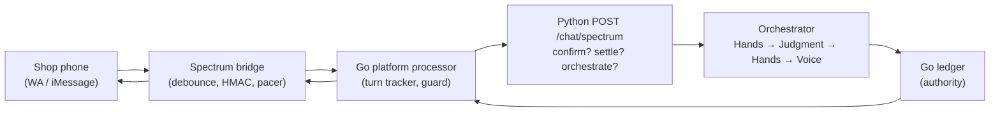
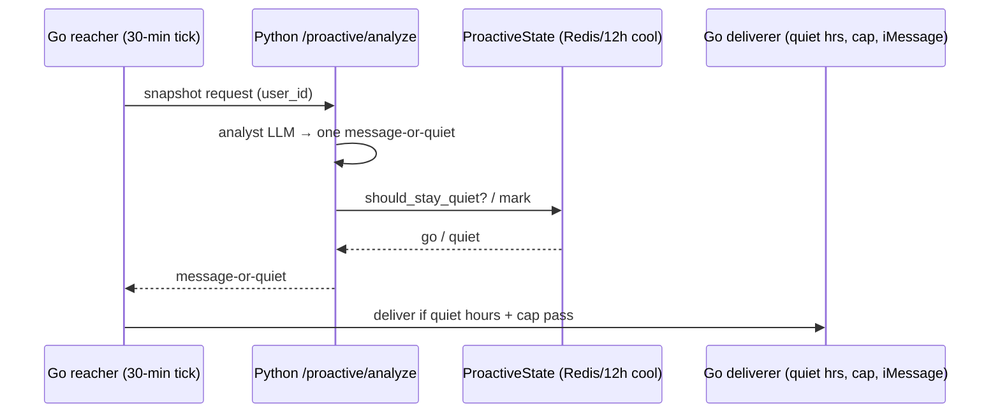
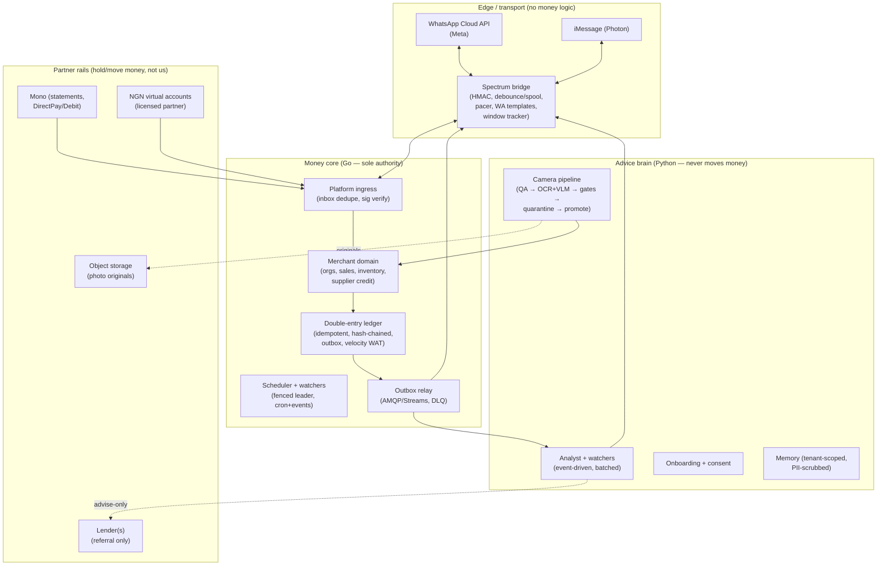

# MIRIAM Merchant System Design — Architecture Document

**Date:** 1 October 2026 · **Status:** Draft for review · **Companion:** `docs/MIRIAM-SME-PIVOT-TECHNICAL-REQUIREMENTS.md` (the TRD — product requirements, market case, §§14–16 research synthesis)

**What this doc is:** the build blueprint. Current-state mapping of both codebases → unified gap register → target architecture with flow diagrams → schema deltas → WhatsApp delivery design → ingestion/trust pipeline → cost/latency → observability/eval → security/compliance → tool choices → 90-day sequence → avoid list → open decisions.

**Evidence discipline:** claims tagged **[V]** were verified by direct read in this session (file + lines). Claims tagged **[A-R]** come from the read-only RAIL_BACKEND audit (file:line refs included, re-verify before building against them). Claims tagged **[A-M]** come from the read-only MIRIAM audit (same caveat). Claims tagged **[R]** come from the infra deep-research track (Sept–Oct 2026 sources). Untagged = synthesis/opinion.

---

## 1. Goals & non-functional requirements

### 1.1 What the system must do (from the TRD)

Always-on agent for Nigerian trading SMEs: camera till (phone photos of stock books/shelves → verified sales ledger) → daily advice → payment verification (fake-transfer protection) → supplier-credit referral (no lending, no licence). Transport: WhatsApp-first via the existing Photon/Spectrum bridge, iMessage where live. Payer: brand/distributor per verified retailer. All SME tiers through one route; 10–100 staff payroll/tax is Phase 2.

### 1.2 NFRs (the ones that actually constrain design)

| # | Requirement | Target | Why it binds |
|---|---|---|---|
| N1 | No double-post of money | Effective exactly-once (at-least-once + idempotent consumers) | Per-sale ledger rows multiply volume; a commit race that was rare on 70/30 splits becomes daily loss |
| N2 | No invented balance | Every money figure traceable to ledger rows; LLM never computes | Terminal trust loss with merchants; lender pack must be verified-only |
| N3 | No cross-shop data leak | Tenant isolation with CI-enforced tests | One merchant seeing another's books ends the company |
| N4 | Reply latency | Reactive ≤8s P95, extraction notify ≤90s, ack+typing ≤2s | WhatsApp users abandon slow threads; extraction is async by design |
| N5 | Proactive cost discipline | >80% reactive traffic; proactive via utility templates, ≤1/day default | WA per-message billing; one misclassified daily template × 30k sends ≈ $1,548 vs $201 **[R]** |
| N6 | Window compliance | Free-form only inside 24h window; templates outside | Meta rejects + quality-rating hits otherwise **[R]** |
| N7 | Survivable deploys | No split-brain double advice; no lost money events on restart | Leader-lease lapse + non-idempotent jobs = duplicate sends/charges |
| N8 | Auditability | Every money claim reply stores (message_id, entry_ids, amounts, tier, model+prompt version), 2y retention | "You told me ₦84,500" must be answerable in one query |

---

## 2. Current-state mapping (what exists, verified)

### 2.1 MIRIAM Python agent (this worktree) **[V]**

**Money path — the invariant to preserve.** `miriam_agent/orchestrator.py:1-28` documents the sole legal path: Hands → Judgment → Hands → Voice. Two structural rules: proposed actions are built only from the user's words (model prose is never parsed for an action), and confirmations are `confirm_id`s that Hands issued (a chat "yes" settles nothing). `CHALLENGE_TTL_MINUTES = 30`. The agent loop (`agents/agent_loop.py`) structurally cannot move money. **Any merchant money flow must extend this path, never fork it.**

**Ledger (Python mirror).** `miriam_agent/hands/ledger.py:1-100`: deterministic, no LLM. Four sleeves (`spendable/savings/yield/locked`), three writers (`credit/debit/move_internal`), Decimal throughout via `money()` coercion, idempotency keys never trimmed (`processed` keys survive journal bounds `RECEIPT_RETENTION=500/MOVEMENT_RETENTION=2000`). Redis store exists for cross-request confirmations with a `version` counter for lost-update detection. **Good core; merchant port means new sleeves/entry types, not new math.**

**Messaging ingress.** `miriam_agent/api/spectrum.py:1-120`: `POST /api/v1/chat/spectrum` with `CHANNELS=("imessage","whatsapp","terminal")`, confirm/settle routing, money-vs-portfolio-vs-fallback routing, money-scrubbed memory. **WhatsApp is a channel string only — no client, webhook, or sender in Python [V].** Transport lives in the bridge + Go.

**Two brains, one product [A-M].** `orchestrator.py` (1,074 lines) owns money turns; `agents/agent_loop.py` (979 lines) owns everything else; `api/chat.py` (1,627 lines) + `api/spectrum.py` route via `classify_turn()` (regex/keyword in `orchestrator.py`). A misclassified money sentence — a Pidgin phrasing like "I don collect 50k", a photo caption — lands in the read-only loop and money silently doesn't happen, or narration claims what the ledger never did. For camera-till (every sale = photo + short caption), the classifier is the most-exercised, least-tested boundary → fix is §3 G21.

**Contract drift [A-M].** `ARCHITECTURE-CONTRACT.md` references packages that don't exist (`miriam_agent/vector/`, `miriam_agent/investments/`, `miriam_agent/intel/`, `onboarding/evals.py`) and an `import-linter.ini` never created (the AST suite `tests/architecture/test_module_rules.py` is the real enforcement, different rule set). `P1-BLUEPRINT.md` describes a Go scheduler + `POST /api/v1/intel/evaluate` + `miriam_agent/intel/` — none exist; the real path is `proactive/analyst.py` + `POST /api/v1/proactive/analyze`. **Build from the code (§2.3 flows), not the blueprint — then fix or delete the phantom docs (§3 G32).**

**No migrations story [A-M].** Production boots via `Base.metadata.create_all` (unversioned DDL) while `scripts/init-db.sql` describes a *different* schema (`VECTOR` vs JSON embedding, missing `channel_identities` table entirely). No Alembic, no migration CI. First schema change in production is a manual incident → fix is §3 G27. Related: zero indexes on hot paths (`conversations.user_id`, `messages.conversation_id`, `memory_entries(user_id,type)`); pgvector declared but unused (`embedding` mapped as JSON, search is token-overlap "hybrid-lite"); naive-UTC Postgres vs aware-UTC ledger vs Lagos cap boundary (§3 G28, G29).

**Operational gaps [A-M]:** `entrypoint.sh` runs **two** uvicorn processes per container with no graceful drain — per-process ledger fallback = divergent ledgers during Redis outage (§3 G22); ledger write conflicts (Lua CAS → `LedgerConflictError`) surface to the user with no reload-and-retry; `/health` (liveness) gates deploys while `/health/ready` (DB/Go/LLM probes) gates nothing; no resource limits; OTel exports to `debug` only. Money-audit sink is fail-open (settled money, missing durable row — §3 G25). Chat-side money-number scrubbing persists full text locally (only the graph copy is scrubbed — §3 G26). `ALLOW_CHAT_INFLOW_SYNTH` + text-hash `inflow_id_for_alert()` lets pasted chat text mint ledger money when enabled; two wordings of one bank alert = two inflows (§3 G23). `money/reference.py` is placeholder (`sourced=False`, `REFERENCE_AS_OF=2026-09-19`) with a fail-closed kill-switch ~Dec 2026 that refuses all investing (§3 G31).

**Proactive (pull-based).** `miriam_agent/proactive/analyst.py:1-80`: on demand pulls a snapshot, LLM returns one JSON `{should_reach_out, priority, category, message, reason}`, fail-open (missing data/dead backend = stay quiet). Never moves money, stores, or delivers — delivery is Go's job. `miriam_agent/proactive/state.py`: Redis-backed dedupe + in-process fallback, 24h TTL, `PROACTIVE_MIN_INTERVAL_HOURS=12` default. **Fail-open + in-process fallback = duplicate-send risk under multi-instance; no event triggers; per-call LLM with no batching.**

**Data layer — single-tenant, float money.** `miriam_agent/database/models.py:1-279`: `User` single identity; everything (`FinancialProfile`, `Conversation`, `MemoryEntry`, `AuditLog`, `ToolUsage`) keyed by `user_id`. **No `org_id` anywhere; grep for `org_id|tenant|shop_id|sale_|inventory|sku` returns only `merchant` strings in document-extraction code [V].** Money columns are `Float` (`Transaction.amount`, `monthly_income`, `Investment` prices) while Hands uses Decimal — **float/Decimal boundary inconsistency, must fix before merchant figures.** Bright spot: `ChannelIdentity` has `(channel, handle)` globally unique with rail-authenticated handle moves — the right shape for binding merchant staff phone numbers, survives SIM swap/reinstall.

**Config & compose — prod guards are real.** `miriam_agent/config/settings.py`: `RAIL_SERVICE_KEY` required in prod, `ALLOW_CHAT_INFLOW_SYNTH=false`, per-turn caps (`AGENT_MAX_COST_USD_PER_TURN=0.05`, `12000` tokens, 30s wall-clock), proactive caps (700 tokens), `MONEY_DAY_TIMEZONE=Africa/Lagos` (pinned — RAIL's velocity bucket is UTC, see §3), document pipeline settings (`DOCUMENT_OCR_URL`, reconciliation tolerance). `docker-compose.yml`: Postgres 15 + Redis 7 with healthchecks, all secrets `:?`-required, `ALLOW_CHAT_INFLOW_SYNTH=false` hardcoded so host env cannot override.

**Architecture contract — exists, partially enforced.** `docs/ARCHITECTURE-CONTRACT.md`: layered modules + import-linter + AST rules (no LLM-layer DB writes, provider injection, 700-LOC blob ratchet, tool schema contract, trace-id chain). **Grandfathered violations on record** (`tools→agents`, `tools→financial`, `integrations→financial`) — layering is aspiration + ratchet, not fact. `orchestrator.py` at 1,074 lines exceeds the 700-LOC ratchet (register or split before adding merchant flows).

### 2.2 RAIL_BACKEND Go authority [A-R]

Solid foundation, wrong shape for merchants. Double-entry ledger with `shopspring/decimal`, hash-chained `ledger_transactions`, velocity breaker, outbox writer, Mono adapter with fail-closed webhook secret, bridge HMAC (SHA-256, 5-min freshness), genuinely well-built iMessage pipeline (durable debounce spool, carry-forward, bubble idempotency). Scale of the surface: ~15.6k-line DI package (30 files), 2,259-line `routes.go` + 13 register files (~405 routes), 80 domain service packages, 45 worker dirs, 280 migrations.

WhatsApp: `whatsappBusiness.config()` coded in the bridge, gated on `WHATSAPP_ACCESS_TOKEN` + `WHATSAPP_PHONE_NUMBER_ID` — **no template sender, no 24h-window tracker, no per-message cost code anywhere.**

**Two-bridge correction [A-M]:** there are **two** bridge codebases. The RAIL-side bridge (`cmd/spectrum-bridge`, `spectrum-ts@12.8.0`) has the WA provider coded-but-gated above. The **MIRIAM-side gateway (`apps/spectrum-gateway`) wires only `terminal` + `imessage` (+ local iMessage)** — its `package.json` has no WhatsApp provider, `src/index.ts` carries only a "WhatsApp later via `whatsappBusiness.config({...})`" comment. It sends one shared `MIRIAM_TOKEN`/`MIRIAM_USER` for all traffic, so first-seen `(channel, sender_id)` auto-links every sender to one JWT user until a rail-keyed merge endpoint (never called by the gateway) runs — **every WhatsApp sender shares one identity until fixed** (§3 G24). The TRD's "WhatsApp via Spectrum provider" (§1 decision log) therefore means: **enable + prove the RAIL-side provider, build the MIRIAM-side provider (or retire that gateway in favour of one bridge), and fix per-sender identity — three items, not one.** No media-ID → bytes → OCR seam exists on either path; camera photos cannot arrive yet.

Outbox writer has a `TODO: Route to message broker` — **events currently go to logs.** No org tables across all 280 migrations; `ReferenceID *uuid.UUID` cannot hold `SALE-2026-000147`; virtual accounts `UNIQUE(user_id, currency)` (1:1, no per-sale refs). `/internal` group rate-limited to 5 req/min. Four auth mechanisms with different revocation semantics. Full Top-15 with file:line refs in §3.

### 2.3 Request flows today (mermaid)

**Reactive chat (both channels):**


**Proactive today (pull, consumer-shaped):**


---

## 3. Unified gap register (P0 blocks the pilot, P1 blocks scale, P2 blocks trust-at-scale)

P0 = no merchant pilot without it. Each item: severity · owner system · evidence · fix.

| # | Sev | Gap | Evidence | Fix |
|---|---|---|---|---|
| G1 | P0 | No org/member/staff/RBAC in either codebase | **[V]** Python: no `org_id` in any model; **[A-R]** Go: no org tables in 280 migrations, `users` email-UNIQUE, only `AdminAuth` user/admin | `organizations`, `org_memberships(role,status,invited_by)`, staff roles owner/manager/cashier/viewer + lender-liaison read-only; RBAC middleware + RLS backstop; staff-aware `initiated_by` |
| G2 | P0 | No merchant write paths anywhere | **[V]** Python: no sale/inventory/SKU code; **[A-R]** Go: no sales/inventory/suppliers/credit schema, zero merchant endpoints | New `/merchants/*` group (Go) + Python tools, following the investment-glider staged-mutation pattern (staged 202 + payload-bound confirmation tokens + `RequireMiriamConfirmHeader`) |
| G3 | P0 | WhatsApp business-initiated send impossible | **[A-R]** bridge `index.ts:865` WA conditional; zero template/window code in `internal/` + bridge; **[V]** Python WA = channel string | Template sender + conversation-window tracker + template registry/approval flow; confirm WA creds in prod; WA quality/tier monitors |
| G4 | P0 | Money events go to logs, not to the agent | **[A-R]** `ledger_outbox_publisher/worker.go:dispatch()` broker TODO; `context.Background()` on Miriam publish; retry ceiling 10 → warn-log dead-letter | Sink outbox to AMQP (`PLATFORM_AMQP_URL`) or Redis Streams with consumer contracts; DLQ table + alerts; propagate context |
| G5 | P0 | Concurrent commit can double-apply balances | **[A-R]** `ledger/service.go:224-290` check-then-act, no `SELECT FOR UPDATE` / conditional UPDATE | `UPDATE … WHERE status='pending'` + rows-affected check, return the tx; add pending-reaper worker |
| G6 | P0 | Retries defeat idempotency | **[A-R]** `service.go:797,852,1055` `time.Now().UnixNano()` keys; replay returns nil without existing tx | Deterministic keys from business identity (`sale-{shop}-{ref}-v1`); return existing tx on replay |
| G7 | P0 | Velocity breaker may be off, wrong day | **[A-R]** `ledger_entities.go:359` nil=disabled, currency unspecified, bucket `Truncate(24h)` = UTC | Fail boot if unset; per-currency limits; bucket in `Africa/Lagos` (match Python `MONEY_DAY_TIMEZONE` **[V]**); metrics on trips |
| G8 | P1 | Python money columns are Float | **[V]** `models.py`: `Transaction.amount`, `monthly_income`, investment prices all `Float` vs Hands Decimal | Migrate money projections to `Numeric`; Decimal at every boundary; CI exact-kobo golden assertions |
| G9 | P1 | Hash chain verifies links, not content; full-scan checks | **[A-R]** `service.go:2027+` link-only check (comment admits), `CheckIntegrity:1879` O(chain) no checkpoint | Recompute content hashes (load entries); checkpoint table for incremental verification; alert on break |
| G10 | P1 | Cross-currency books 1:1 without FX | **[A-R]** `entries.go` Validate sums only; `CreateConversionUSDCToUSDEntries` same-amount different currency | Same-currency balance OR explicit FX rate + source on tx; per-currency scale validation (kobo vs 6dp) |
| G11 | P1 | Scheduler: no fencing, ticker drift, 43 hand-rolled failure policies | **[A-R]** `leader.go` SET NX no fencing; every worker `time.NewTicker`; only 2 workers have real DLQ | Fencing tokens or idempotent job-claims; shared scheduler lib (aligned cron, catch-up, backoff/DLQ); document double-run safety per worker |
| G12 | P1 | Proactive loop is per-user LLM sweep, not event-driven | **[V]** analyst per-call LLM + 12h cooldown; **[A-R]** `proactive_reacher` 30-min O(users) `AnalyzeProactive` | Event-triggered outreach (sale/stock/credit/delivery events) + merchant watchers; keep sweep as fallback; batch + prioritize |
| G13 | P1 | iMessage caps applied to WA; zero message-cost metering | **[A-R]** `deliverability.ts` 5k/day Photon caps; cost code covers AI usage only | Separate WA tier/quality tracker; per-message cost rows (category, direction); per-merchant caps |
| G14 | P1 | Bank feeds miss merchant reality | **[A-R]** Mono decent (fail-closed secret ✓) but no cash/OPay/PalmPay, pending-vs-cleared unresolved, no staleness alerts | Manual cash-sale + statement-import paths; cleared-only accounting; `last_synced_at` freshness SLO + alerts |
| G15 | P1 | Per-sale refs don't fit; no merchant schema | **[A-R]** `ReferenceID *uuid.UUID`; 1:1 virtual accounts `UNIQUE(user_id,currency)` | String `business_ref` + type with unique index; `sales/sale_items/products/suppliers/supplier_credit/stock_moves`; narration/reference matcher (no per-sale account sprawl) |
| G16 | P1 | Agent integration surface undiscoverable + throttled | **[A-R]** 405 routes, 4 auth mechanisms, `/internal` 5 req/min, no timeout/retry contract | One documented service-auth; raise/scope `/internal`; publish idempotency/backoff/polling contract |
| G17 | P2 | Python orchestrator exceeds blob ratchet; layering grandfathered | **[V]** `orchestrator.py` 1,074 LOC vs 700 ratchet; 3 grandfathered upward imports | Register-or-split orchestrator before merchant flows; burn down grandfathered edges |
| G18 | P2 | Proactive state fail-open duplicates under multi-instance | **[V]** `state.py` in-process fallback when Redis down | Fail-closed on state writes for money-relevant outreach, or sticky routing; CI chaos test (kill Redis mid-tick) |
| G19 | P2 | Migrations crude recovery; dead deploy targets; stale test map | **[A-R]** `database.go:132-136` `Force(version-1)`; fly/k8s/helm/terraform remnants; `test/README.md` still "STACK" | Alert on dirty + manual runbook; delete/archive non-AtlasFlow targets; rewrite test README |
| G20 | P2 | NDPR posture: helpers without a program | **[V]** Python has PII redaction posture (`TYPESAFE_REDACT_USER_TEXT` default true); **[A-R]** Go has `pii.go` helpers but no consent/retention/DSAR/staff-access logging | Consent records, retention schedule, DSAR flow, field-level encryption, staff-access logging (§10) |
| G21 | P0 | Regex turn classifier misroutes money (Pidgin/typo/photo-caption sales) | **[A-M]** `orchestrator.py classify_turn`, `api/chat.py`, `api/spectrum.py`; no classifier golden set | Route money intents on deterministic `hands/nl.py` parser verdict + explicit "unknown → ask"; classifier golden set (Pidgin, typos, Hausa/Yoruba/Igbo, photo captions); fail-closed on low confidence |
| G22 | P0 | Two uvicorn procs × per-process ledger fallback = divergent ledgers in outage | **[A-M]** `api/chat.py _get_ledger_store`, `entrypoint.sh` (ports 8000+3000, `trap kill`, no graceful timeout) | One ledger-store process (one worker or externalized handle), one uvicorn per container, `--graceful-timeout` + lifespan drain (PG engine, Redis, judge client); reload-and-retry ×3 on `LedgerConflictError` |
| G23 | P0 | Pasted chat text can mint ledger money; duplicate wordings double-count | **[A-M]** `ALLOW_CHAT_INFLOW_SYNTH` + `looks_like_inflow_alert()` + text-hash `inflow_id_for_alert()` | `PaymentReference` (sender, amount, ref, channel, hash) with unique constraint; inflow dedupes on reference not text; fake-alert rejection tests; fail CI if synth flag true outside dev |
| G24 | P1 | Shared gateway JWT: all WA senders share one identity | **[A-M]** `apps/spectrum-gateway/src/miriam.ts` + `index.ts` shared `MIRIAM_TOKEN`; `spectrum.py` first-seen auto-link, failures swallowed; merge endpoint never called | Per-sender identity (gateway exchanges phone/user-id for scoped token or sender assertion Go verifies); verified-merge on handle conflict; never silent cross-handle auto-link |
| G25 | P0 | Money-audit sink fail-open: settled money, missing durable row | **[A-M]** `_persist_money_audit` try/except ("fail-open by contract"), Redis blob rewritable + trimmed at 500 | Bounded synchronous retry (3× backoff), block settlement acknowledgement on durable write or journal receipts to durable outbox first; alert on sink failure |
| G26 | P1 | Full money text persisted in Postgres forever (only graph copy scrubbed) | **[A-M]** `store_interaction` persists full text locally; scrub only before Supermemory ingest | Scrub/tokenize amounts at persistence boundary (separate encrypted column or omit from `messages`); retention TTL + user erasure endpoint (wire Supermemory `forget`/`erasure`); NDPR retention doc |
| G27 | P1 | No migrations; `create_all` vs SQL file describe different schemas | **[A-M]** `MemoryStore.initialize` → `create_all`; `init-db.sql` missing `channel_identities`, VECTOR-vs-JSON embedding split | Alembic from day one; reconcile models ↔ SQL (add `channel_identities`, fix embedding type); missing-migration CI check |
| G28 | P1 | Zero hot-path indexes; N+1 memory reads; dual pools; vector unused | **[A-M]** `database/models.py` (no indexes on `conversations.user_id`, `messages.conversation_id`, `memory_entries(user_id,type)`); `memory.py` fan-out `limit(max(limit*4,20))`; two engine singletons; token-overlap "hybrid-lite" | Add indexes; fix N+1; single pool config with connection math for gateway+app+worker topology; decide pgvector-vs-keyword and implement one |
| G29 | P1 | Timezone split-brain: naive-UTC DB vs aware-UTC ledger vs Lagos caps | **[A-M]** `TIMESTAMP WITHOUT TIME ZONE` + `utcnow_naive()` vs tz-aware receipts; `settled_outbound_today()` skips naive rows | Migrate DB to `TIMESTAMPTZ`, aware-UTC writes everywhere, Lagos only as display/cap-boundary zone; backfill + timezone-consistency test |
| G30 | P1 | Camera pipeline is bank-statements-only; OCR sidecar undeployed + request-blocking | **[A-M]** `documents/` classifies bank_statement/receipt/invoice, receipt/invoice complete with empty extraction; `DOCUMENT_OCR_URL` default empty; no sidecar in compose; 60s block; no QA/retake/confidence tiers | `processors/stock_count.py` (item×qty×price) + `capture_qa` stage (blur/glare/crop → `ask_retake`) + confidence tiers; sidecar in compose with tight timeout + async (upload → notify) |
| G31 | P1 | Macro rates placeholder with ~Dec 2026 kill-switch refusing all investing | **[A-M]** `money/reference.py` (`sourced=False`, `REFERENCE_AS_OF=2026-09-19`, `MAX_AGE_DAYS=90`) | Stand up feed owner + updater (NBS/CBN or vendor), or narrow pivot to not need macro rates; gate every rate-dependent verdict on `sourced=True` meanwhile; quarantine Glider path from SME turns (resolver-less drafts can only refuse) |
| G32 | P2 | Phantom docs + unreadiness gates: blueprint APIs that don't exist, `/health` green while money 503s, OTel debug-only | **[A-M]** `P1-BLUEPRINT.md` (`intel/evaluate`, `miriam_agent/intel/`); compose `depends_on` without `service_healthy`; `otel-config.yaml` → `debug`; dev/prod compose drift | Implement-or-delete `intel/` blueprint; gate compose on `/health/ready`; memory/CPU limits; ship OTLP backend + verify Sentry; align dev/prod compose |

---

## 4. Target architecture

### 4.1 System context (to-be)



**Rules (carry over from §§2–3):** Python never posts to the ledger directly — all merchant money enters through Go entry types. Go never writes advice copy — it calls the Python analyst. Watchers are plain code; the model only writes the message. Every figure traceable to ledger rows. Money numbers stay out of long-term graph memory (extend existing scrubbing **[V]**).

### 4.2 Reactive money flow (saga, to-be)

```mermaid
sequenceDiagram
    autonumber
    participant M as Merchant (WA)
    participant SB as Bridge
    participant IX as Ingress inbox (Go)
    participant Q as Queue (Streams)
    participant W as Worker
    participant L as Ledger (Go tx)
    participant OB as Outbox + relay
    participant PY as Python analyst
    M->>SB: photo / text ("sold 12 Indomie")
    SB->>IX: webhook (HMAC verify, <1s 200)
    IX->>IX: dedupe wa_message_id (conflict=ack+drop)
    IX->>Q: enqueue (idempotency key req_org_shop_ext_op)
    Q->>W: T1 IngestEvidence → quarantined candidate
    W->>W: T2 VerifyPayment (VA webhook / Mono; verified|unmatched|conflicted)
    W->>L: T3 PostLedger (conditional commit, deterministic key)
    L->>L: entries + outbox rows + inbox marker (ONE tx)
    OB->>PY: money event (no money in payload, refs only)
    PY->>PY: render receipt + advice from precomputed numbers
    OB->>SB: reply (window check → free-form or template)
    SB->>M: receipt + advice
    Note over W,L: Each step has a compensating action:<br/>quarantine, flag-for-review,<br/>reversal entry (never DELETE), correction message
```

### 4.3 Key design decisions (with reasons)

1. **Postgres outbox + Redis Streams, not Kafka-first.** Single-writer Postgres is already the system of record; Kafka as a second writer creates dual-write holes. CDC → queue only when volume justifies (>~500 msg/s sustained) **[R]**.
2. **At-least-once + idempotent consumers = effective exactly-once.** No true exactly-once spans Meta's API. Key format `req_{org}_{shop}_{external}_{op}_v1`, `UNIQUE(idempotency_key)`, 30-day TTL, replay returns original **[R, §3 G6]**.
3. **Sagas, never 2PC.** T1–T4 above with compensating actions; durable workflow engine persists step state + retries with backoff/jitter; human review is a durable `waitForSignal`. Never gate *after* an irreversible send — gate before, compensate after **[R]**.
4. **One static virtual account per shop** (+ per-lender collection refs where required). Never mint per-customer/per-invoice accounts — sprawl explodes reconciliation and partner fees. Match inbound by amount+sender+±15-min window **[R, §3 G15]**.
5. **LLM arithmetic ban extended.** All sums in Go/SQL minor-units (kobo INTEGER/BIGINT); model renders precomputed numbers; CI asserts exact-kobo equality on golden money answers (extends `safety/grounding.py` clamp **[V]** + TRD T2).

---

## 5. WhatsApp delivery design (the cost center)

**Window discipline [R].** Inside 24h of merchant's last message: free-form text/buttons/images. Outside: approved templates only. >80% of traffic must be reactive (merchant photo/text → in-window reply). Proactive slots (metered): one daily summary, one money-event (payment confirmed/mismatch), one weekly credit. Batch the day — one 4-line morning template beats 5 pings (5× cost, 5× block risk).

**Pricing (per delivered message since 1-Jul-2025, Nigeria indicative ex-BSP markup [R] — pin live card in CI, re-verified 2 Oct 2026):** Marketing ~$0.0516 (never for money content), Utility ~$0.0067 (~₦9), Authentication ~$0.0145, Service in-window free + unlimited, utility templates inside an open window free. Budget anchor: 1,000 shops × 30 daily utility summaries × $0.0067 ≈ **$201/mo base + BSP markup**. **Template category discipline is a P&L control** — one misclassified daily template × 30k sends = $1,548 vs $201. Full stack + pilot math (300 shops ≈ $400–650/mo): master guide Part 13.

**What to build (§3 G3/G13):** `send_gate(shop, kind)` — checks window state + template status before every send; violations compile-time-impossible. Template registry table fed by `message_template_status_update` webhooks; `PAUSED` auto-fails to approved fallback; immutable versions (`daily_summary_v3`); STOP/opt-out path in every proactive template. Per-message cost rows (category, direction) feeding per-merchant caps and the outcome-metering ledger (§8 TRD). Number strategy: 2–3 numbers (advice vs receipts vs alerts) so a quality hit on one doesn't halt money receipts; warm new numbers slowly; auto-pause proactive per-number on Yellow, page on Red. Throughput tiers ladder 250→1k→10k→100k→unlimited unique/24h **[R]**.

**Free-window acquisition:** QR stickers in shops ("Snap your stock book → WhatsApp us") — every scan opens a free 24h window **[R]**.

---

## 6. Ingestion + trust pipeline (camera → ledger)

Six stages; the camera pipeline **proposes**, a deterministic gate **promotes** — it never writes `stock_movements` or ledger rows directly **[R]**:

1. **Capture QA** (before spend): server rejects <720p effective, motion blur (Laplacian variance), cut-off edges; client hints ("flatten page"). Original immutable in object storage (content-hash key, signed URLs 15-min expiry).
2. **Extract**: OCR (layout+handwriting) → line candidates with boxes; VLM reads image with OCR as context → structured JSON + per-field confidence + box refs (schema-enforced). Two-model agreement is itself a signal.
3. **Validate (deterministic, no LLM):** Σ line_totals == page_total ± tolerance; price-band check (shop 30-day median ± tolerance — catches "₦500 entered as ₦5,000"); date sanity; duplicate check (content + perceptual hash vs 30d); unit normalization.
4. **Quarantine + review:** failures → `ingest_quarantine` with reason codes; merchant gets WhatsApp clarification ("Line 3: 12 × ₦450 = ₦5,400 but page says ₦54,000 — reply 1 or 2"), max 2 follow-ups then human queue; reviewer decisions feed the golden set.
5. **Tiered trust on the entry:** `verified` (bank-webhook-matched or reviewer-confirmed) · `reported` (gates passed, merchant-attested) · `unverified` (single weak source) · `conflicted` (sources disagree). UI/advice always label the tier; **lender pack = verified-only + consent receipt**.
6. **Reconcile (nightly + on bank-webhook):** match `SALE_TRANSFER_UNMATCHED` ↔ VA credits by amount+account+±15-min+sender fuzzy; Mono second source; unmatched >48h escalates to merchant. Fake-transfer rule with teeth: **only partner webhooks / Mono statements confirm money — never user-forwarded SMS text** (documented spoof vector: Moniepoint/OPay alerts) **[R]**.

**Confidence without early collapse:** per-field confidences ride through to advice; aggregates as distributions; collapse to one number only at render with rounding + tier label **[R]**.

---

## 7. Ledger & merchant schema deltas

### 7.1 Ledger invariants (Go owns; Python never posts directly)

Double-entry, immutable, minor-units (kobo BIGINT, never FLOAT — §3 G8). Entry types enumerated: `SALE_CASH, SALE_TRANSFER_VERIFIED, SALE_TRANSFER_UNMATCHED, STOCK_IN_PURCHASE, STOCK_IN_CREDIT, STOCK_COUNT_ADJUST, RECEIVABLE_CREATE, RECEIVABLE_SETTLE, CREDIT_DISBURSE_STOCK, CREDIT_REPAY, FEE, CORRECTION(reversal link)`. DB-enforced: `SUM(debit)=SUM(credit)` per entry (deferred trigger); REVOKE UPDATE/DELETE on postings (corrections are reversing entries); string `business_ref` + type with unique index (§3 G15 — replaces UUID-only `ReferenceID`); `UNIQUE(idempotency_key)` with deterministic keys (§3 G6); `source_confidence` + `trust_tier` on the entry; same-currency-or-explicit-FX rule (§3 G10); velocity in `Africa/Lagos` buckets (§3 G7); content-hash recompute + checkpoint table (§3 G9); pending-reaper (§3 G5).

Multi-currency: `currency + minor + fx_rate_to_ngn snapshot` per entry; NGN default, USD only for supplier imports.

### 7.2 New merchant schema (minimum)

```sql
-- G1: tenancy
organizations(id, name, kyc_status, default_currency='NGN', ...);
org_memberships(user_id, org_id, role, status, invited_by);  -- owner|manager|cashier|viewer|lender-liaison
shops(id, org_id, name, location, timezone='Africa/Lagos', ...);
shop_grants(user_id, shop_id, role);                          -- per-shop override
-- G15/G2: merchant domain
products(id, shop_id, name, canonical_sku, aliases[], unit, cost_band_minor, price_band_minor, embedding);
stock_lots(id, shop_id, product_id, qty_units, unit_cost_minor, acquired_via, expiry?);
stock_movements(id, shop_id, product_id, lot_id?, delta_qty, reason, entry_id FK, occurred_at, source_confidence);
sales(id, shop_id, business_ref UNIQUE, occurred_at, total_minor, trust_tier, entry_id FK, initiated_by);
sale_items(sale_id, product_id, qty, unit_price_minor, line_total_minor);
receivables(id, shop_id, customer_label, entry_id, amount_minor, due_at, status);
receivable_events(receivable_id, amount_minor, kind, entry_id, at);
credit_applications(id, shop_id, lender_id, consent_receipt_id, verified_sales_90d_minor, requested_limit_minor, status);
credit_facilities(id, shop_id, lender_id, limit_minor, disbursed_as_stock_minor, repaid_minor, first_loss_pct, status);
consents(id, shop_id, purpose, scope, granted_at, expires_at, revoked_at);
webhook_inbox(source, external_id UNIQUE, payload_hash, received_at);   -- Meta/Mono/partner dedupe
outbox_messages(id, to_wa, template/body, idempotency_key UNIQUE, sent_at, provider_msg_id);
message_costs(shop_id, direction, category, cost_minor, at);            -- per-message metering
```

**Isolation: app-level + RLS both [R].** Every query carries `org_id/shop_id`; pool sets `app.current_org/shop` per tx; RLS policies as blast wall; `pgvector` search tenant-filtered; dedicated CI suite asserts cross-tenant invisibility connecting as app role. Receivables aging is a view (`0-7/8-30/31-60/60+`), recomputed nightly — the agent reads the view, never ad-hoc arithmetic.

### 7.3 Python-side deltas

New tools (typed adapters, `risk_level/is_mutation/requires_approval` per contract **[V]**): `record_sale`, `adjust_stock`, `create_receivable`, `settle_receivable`, `refer_credit` — all staged through Hands challenges + Go confirm headers (glider pattern). Money projections migrate Float→Numeric. New `merchant/` package (org-aware analyst inputs, price-band cache reads, tier-labeled rendering). Orchestrator: register-or-split the 1,074-line blob before adding flows (§3 G17). Proactive state: fail-closed writes for money-relevant outreach or sticky routing (§3 G18).

---

## 8. Inference cost/latency architecture

**Model routing (rules first, learned later) [R]:** Tier 0 deterministic (greetings, receipts, balance reads, STOP → templates + ledger queries; target 50–60% of turns) → Tier 1 small/cheap (intake classification, clarification, summary rendering from precomputed numbers; ~512 output cap) → Tier 2 frontier/VLM (photo extraction, dispute reasoning, credit-pack narrative; only on low-confidence/complex/conflicted or money delta >₦50k). Rules: has-image → Tier 2 extraction; money question → ledger tool + Tier 1. Budget for 60%+ of photo turns needing Tier 2 (camera till is vision-heavy by nature).

**Context discipline:** per-shop rolling summary in Postgres (agent loads summary + last 10 turns, not history); nightly compaction >50 turns; never re-stuff OCR dumps (reference by `entry_id`). Prompt-cache static prefix; catalog/price-band/ledger-read caches in Redis (price bands 24h, today's totals 5-min TTL); content-hash → prior extraction (7d) kills re-processing of re-sent photos.

**Budgets:** extraction ≤60s, chat reply ≤12s P95 <10s, extraction notify <90s; per-shop daily inference budget with graceful "summary mode" degradation; workflow timeouts with queued-then-notify fallback. Fan-out: webhook worker only enqueues; GPU/VLM workers scale independently; merchant never waits on model latency inline.

---

## 9. Observability + eval as infrastructure

**Tracing [R]:** one `trace_id` per inbound message across Python/Go/bridge (extends `observability/correlation.py` chain **[V]**); `shop_id/org_id/hashed wa_id/idempotency_key/trust_tier` as span attributes, never raw PII; OTel Collector **tail-based sampling** (100% errors/money-posts/quarantines, 1–5% successful reads) — the anti-bill measure; PII redaction at the collector.

**Golden-set CI gates [R]:** ~200 versioned cases (`eval/golden/`): 60 photo extractions (incl. blurry/handwriting), 60 money Q&A (exact-kobo expected), 40 clarification flows, 20 dispute/consent refusals, 20 template-compliance checks. **Money-answer exactness + no-hallucinated-balance are merge-blocking.** Tooling: Langfuse (self-hostable) or Braintrust — pick one (§11). Every prompt/router/threshold change runs the gate.

**Online:** 5% production turns async judge-scored (groundedness vs ledger rows, Nigerian-English/code-switch tolerance, tier labeling); never inline. Dashboards: confidence mix by tier/day/shop (unverified spike = regression), reconciliation health (match rate, median lag, unmatched >48h), money accuracy (groundedness, corrections/1k replies), WhatsApp health (delivery, quality, spend/day by category, window-hit rate). **Alert thresholds:** match rate <85% page; groundedness <95% page; quality Yellow auto-pause + notify; extraction P95 >90s ticket; template spend 2× trailing ticket+ack; RLS failure blocks deploy.

**Audit trails (N8):** `(message_id, entry_ids, amounts_shown, tier_shown, model_version, prompt_version)` per money reply; 2y retention; per-merchant export.

---

## 10. Security / compliance architecture

**NDPA/GAID (2023 Act + March 2025 guidance) [R]:** WhatsApp opt-in recorded per-purpose (advice vs lender-referral separate; referral expires; "STOP"/"delete my data" revocable); DPIA filed before lender-referral launch (large-scale financial + vulnerable-population data triggers it; keep `docs/DPIA.md`); minimization (photos 2y, ledger 7y financial-record, traces 90d, embeddings deleted with source); DSAR export+delete ≤30 days; cross-border inference needs transfer basis (prefer EU region / documented US SCCs; state residency in privacy notice). PII redaction pre-model stays default-on (extends `TYPESAFE_REDACT_USER_TEXT=true` **[V]**); adversarial CI cases for the redactor.

**CBN boundaries (referral, never holding funds) [R]:** agent never holds/pools/moves customer funds — collections land in **partner-issued NGN virtual accounts** (licensed MFB/PSB), settlement partner→merchant bank; Mono = data + mandate rails on the partner's licence. Contracts: referral/MSA per lender + VA provider; product copy never offers loans ("we introduce you to…"); lender discloses terms verbatim. Controls: daily partner-settlement vs ledger reconciliation; single-shop payout review threshold; per-lender kill switch; CBN-auditable referral records (who/whom/when/which consent).

**Secrets + webhooks + kill switches [R]:** real manager (Doppler → AWS SM/Vault), runtime injection, per-env isolation, dual-accept rotation. Verify **every** inbound signature (Meta `X-Hub-Signature-256`, Mono secret fail-closed **[A-R]**, partner HMACs); alert >5 failures/10min; complete the PAJ/RampHub/Brij rows of the auth matrix before money depends on them (§3 G16-adjacent). Kill switches as config flags (no deploy): `proactive_sends`, `lender_referrals`, `photo_intake`, per-template, per-number, per-lender — each flips to a safe message; exercised in game-days. **Verify in prod:** `InternalRequestSignature` signing secret set (else internal money routes rest on a static key) **[A-R]**.

---

## 11. Tool choices (buy vs build, per layer)

| Layer | Choice | Why (one line) |
|---|---|---|
| Queue + jobs | Redis Streams + Dramatiq/ARQ (Python) + outbox poller; graduate to Temporal when sagas exceed ~5 steps | Redis already required; Streams = consumer groups + ACK without Kafka ops; Temporal wins Go+Python replay/durable-timer; Celery avoided (at-least-once footguns) **[R]** |
| Scheduler | Postgres cron (simple, in-DB schedules) now; Temporal only if needed (decided 1 Oct 2026) | Keep it boring until sagas/complexity demand more; idempotent per-shop runs from day one |
| Object storage | Cloudflare R2 (primary) / S3; MinIO local | R2 zero egress (review/judge re-fetch gets expensive on S3); content-hash keys; MinIO keeps dev/prod identical **[R]** |
| OCR | Google Document AI behind an interface (decided 1 Oct 2026) | Handwriting/table accuracy on noisy phone photos; pay-per-page; 60-real-photo bench per market; single EU region |
| VLM extraction | Frontier VLM JSON-schema mode + small-model pre-filter (decided 1 Oct 2026) | Handles stock-book variance; schema + box refs + confidence = gateable; small model triages QA/rejects first; single EU region |
| Ledger | Go + Postgres (as specified) | Single writer; `pgx`, `golang-migrate`, minor-unit integers **[A-R]** |
| DB/vectors/cache | Postgres 16 + pgvector + RLS; Redis 7 | One primary (ledger+app+vectors, tenant-filtered HNSW); Redis streams/cache/locks; PgBouncer tx-mode with `SET LOCAL` tenant context **[R]** |
| WA ingress | Meta Cloud API + iMessage, both via photon.codes bridge (decided 1 Oct 2026); hardened FastAPI + inbox table | One bridge host for both transports; raw-payload log 14d for dispute replay |
| Banking data | Mono (statements/DirectPay/Debit) + partner VAs | Mono = signal + mandates; partner rails = actual NGN accounts (no licence held) **[A-R]** |
| Secrets | Doppler → AWS SM / Vault | Runtime injection, rotation + audit, migratable **[R]** |
| IaC/deploy | Terraform + Compose (dev) → AtlasFlow target only; kill dead targets | Compose mirrors prod; Terraform from day one; **delete fly/k8s/helm/terraform remnants** — split fleet breaks leader election (§3 G19) **[A-R]** |
| Eval/obs | Langfuse self-hosted (decided 1 Oct 2026); OTel tail-sampling → Grafana; Sentry | Golden-set CI + online judge + trace→dataset loop |

---

## 12. 90-day build sequence (maps to the TRD's six proofs)

**Milestone 0 — stop the bleeding (wk 1–2).** G5 conditional commit + pending-reaper · G6 deterministic keys · G7 velocity enforced/WAT/currency'd · outbox sink to Streams + DLQ (G4) · `/internal` limits + single service-auth + timeout/retry contract (G16) · verify WA creds + `InternalRequestSignature` secret in prod · archive dead deploy targets (G19) · **MIRIAM-side: single-ledger process + conflict retry (G22), durable audit write (G25), `PaymentReference` dedupe + synth-flag CI gate (G23), classifier golden set (G21), Alembic init (G27).**

**Milestone 1 — money spine (wk 3–5, TRD proofs 3/5 scaffolding).** G1 orgs/memberships/shops + org-scoped ledger + RBAC + RLS + cross-tenant CI · G15 `business_ref` + sales/items/products/suppliers/credit schema · G2 `/merchants/*` staged-mutation group · G8 Float→Numeric (+ G28 indexes/N+1/pool, G29 timestamptz) · G9/G10 ledger hardening · Python merchant tools + orchestrator register/split (G17) · webhook inbox table + `send_gate` · **WA transport spike: photon.codes confirmed for WA + iMessage; repoint/retire MIRIAM-side gateway + per-sender identity (G24) + media→OCR seam (G3/G30 prerequisite).** **Exit bar:** one-shop WhatsApp echo with window/template gate; chaos tests prove no-double-post, no-double-send under webhook replay.

**Milestone 2 — verified intake (wk 6–8, TRD proofs 2/3).** §6 pipeline (QA → OCR+VLM → gates → quarantine + WA clarification loop) · transfer-webhook matching with one partner + fake-alert refusal copy · cash-sale + statement-import paths + cleared-only accounting (G14) · golden set v1 in CI (blocking money exactness).

**Milestone 3 — advice + trust (wk 9–11, TRD proofs 2/5/6).** Event-driven watchers replace sweep core (G12; sweep stays fallback) · nightly reconciliation + daily utility template + tier-labeled summaries · dashboards (match rate, confidence mix, WA spend) live before 50 shops · audit-trail export · DP file + DPIA + consent flows + cost telemetry (TRD proof 6).

**Milestone 4 — wholesaler credit (wk 12+, TRD proof 4).** Consent flow + verified-only wholesaler pack + one wholesaler pilot behind kill switches (wholesaler funds + first loss; no external lender) · back-test notebook · then scale numbers/templates/Tier-0 deflection.

---

## 13. What to avoid (failure modes with teeth)

1. Single-source trust (photo-alone posting, SMS-screenshot payment confirmation) — only partner webhooks/Mono confirm money.
2. LLM arithmetic — sums in Go/SQL minor-units; CI exact-kobo gate.
3. Unbounded loops — every retry capped + jittered + breaker'd; clarifications max 2 then human; crons idempotent + overlap-locked.
4. Tracing-bill explosions — tail-sample, blobs by object-key reference, PII redacted at collector.
5. Tenant bleed — RLS + tenant-keyed caches + CI cross-tenant tests (extends `ChannelIdentity` handle discipline **[V]**).
6. `interrupt_after` on irreversible actions — gate before, compensate after.
7. Per-sale virtual-account sprawl — one static account per shop; narration/reference matching.
8. Template/window violations — `send_gate` makes them structurally impossible.
9. **New (from audits):** forking the orchestrator money path instead of extending it; taking RAIL's "hexagonal" claim at face value (domain imports infrastructure — one true rule needed); wiring merchant services through 30-file hand DI without a manifest test; letting the 30-min LLM sweep near merchant delivery; **building against `P1-BLUEPRINT.md`'s phantom `intel/` API (G32); trusting `classify_turn()` regexes with Pidgin/photo captions (G21); leaving the OCR sidecar undeployed while promising camera-till (G30).**

---

## 14. Decisions — resolved 1 Oct 2026 (was: open decisions)

1. Pilot routes: two wholesalers, tight weekly runs — Oshodi + Mushin (locked 1 Oct 2026).
2. Per-sale: one static account per shop; match by sender + amount.
3. Transport: photon.codes for WhatsApp + iMessage.
4. Credit: wholesaler funds + takes first loss; no external lender in pilot.
5. Moniebook: verified 6-item list; TRD §9 rewritten.
6. Eval: Langfuse self-hosted.
7. Scheduler: Postgres cron now; Temporal only if needed.
8. Vision/residency: Google Document AI + frontier VLM; 60-photo bench; single EU region.

---

*Trust with money is earned by what never happens: no double-post, no invented balance, no other shop's data, no paid message without a window or template. This design makes each structurally impossible rather than politely discouraged.*
