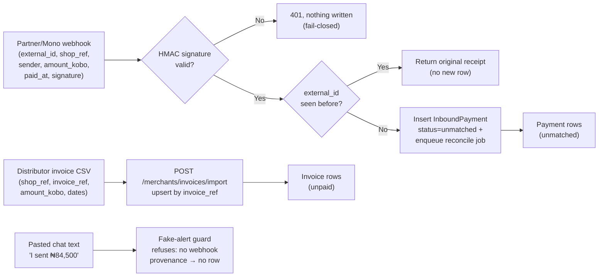
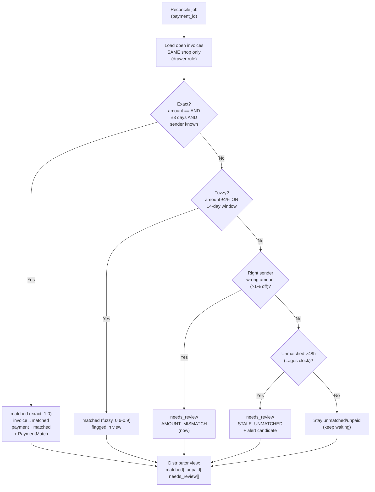
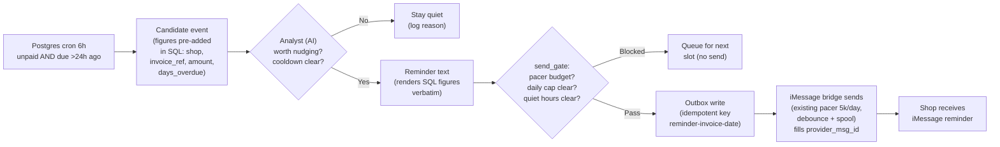

# Miriam SME Pivot — Workflow Specifications (v1: 3 complete workflows)

**Date:** 3 Oct 2026 · **Status:** Draft for approval · **MVP target:** 11 Oct 2026
**Companions:** `MIRIAM-SME-PIVOT-PRD.md` (the why + scope) · `MIRIAM-MASTER-GUIDE-SIMPLE.md` (plain-English front door)
**Channel decision (3 Oct):** iMessage-first for v1 — Meta business approval is blocked, WhatsApp deferred post-MVP. iMessage already works two ways (Mac line + Photon cloud) with a 5,000/day pacer, debounce + durable spool, and per-sender threads. No templates, no 24h-window clock, no per-message Meta cost in v1 — those return with the WhatsApp build.
**Fair onchain touch (3 Oct):** every new `PaymentMatch` best-effort anchors one Solana devnet memo (`miriam:{invoice_ref}:{match_id}:{amount_kobo}`); the reconciliation view returns `anchor_tx` + explorer link. Anchor never blocks matching; CI mocks the RPC.
**Linear:** project "Miriam SME Pivot — MVP (11 Oct)", issues MVP-1…MVP-8, all assigned to Tobiloba

> How to read each spec: **Trigger → Inputs → Processing → AI → Approval → Output → Failure → Verification.** Diagrams read left to right. Money is kobo-int end-to-end; AI never computes.

---

## WF-1 — Financial data ingestion

**Purpose:** invoice CSVs + transfer webhooks enter through one stamped front door and become queryable rows. Nothing else in v1 creates financial data.

### Trigger
- Webhook POST from the licensed partner / Mono on every settled credit into a shop's static account.
- Distributor CSV upload (manual in v1, weekly route rhythm).

### Inputs
- Webhook JSON: `external_id` (partner-unique), `shop_ref`, `sender_name`, `amount_kobo` (int), `paid_at` (tz-aware), `channel`, `signature`.
- CSV rows: `shop_ref`, `invoice_ref` (unique), `amount_kobo` (int), `issued_at`, `due_at`.
- Secrets: webhook HMAC secret (env/Doppler; missing = fail boot).

### Processing (deterministic, no AI)
1. Verify HMAC → 401 on failure, write nothing.
2. Stamp `external_id` → duplicate returns the original receipt (G6).
3. Insert `InboundPayment(status='unmatched')` + enqueue reconcile job.
4. CSV upsert by `invoice_ref` → `{imported, skipped_duplicates}`.
5. Respond 200 in <1s — no matching inline (worker owns it).

### AI
None. Zero model calls on this path (keeps p95 <1s and cost $0).

### Approval
None — ingestion is evidence collection, not a decision. (Matching in WF-2 and sending in WF-3 carry the approvals.)

### Output
- `Invoice(status='unpaid')` rows; `InboundPayment(status='unmatched')` rows; a reconcile job per payment.
- Distributor CSV receipt: imported vs skipped-duplicate counts.

### Failure
| Case | Behaviour |
|---|---|
| Bad signature | 401, nothing written, alert after 5 failures/10 min |
| Replay / duplicate `external_id` | Original receipt returned, no new row |
| Float / malformed amount | Strict-parse reject (400), nothing written |
| Pasted chat text as payment | Refused with "forward the bank alert" copy |
| Downstream queue full | Webhook still 200s (row is safely stored); job retries with backoff |

### Verification
- Replay-flood: same webhook 100x → exactly 1 row (MVP-2 test).
- Re-import CSV → all rows skipped as duplicates.
- 10 seeded fakes (bad sig, replay, pasted text) → 0 payment rows from bad sigs, 0 from text.
- **Linear:** MVP-1 (tables) + MVP-2 (front door) + MVP-7 (gates).

---

## WF-2 — Financial monitoring and alert (reconciliation)

**Purpose:** every payment resolves to matched / unpaid / needs-human-review; the distributor sees the three buckets live. Deterministic code decides; AI only explains.

### Trigger
- Reconcile job per ingested payment (WF-1 output).
- 6-hourly sweeper for the 48h-stale transition (Postgres cron in v1).

### Inputs
- The `InboundPayment` row + all open (`unpaid`) invoices for the **same shop**.
- Lagos-day clock for the 48h rule; kobo-int amounts.

### Processing (deterministic, no AI)
1. Scope to shop (hard filter — cross-shop comparison is impossible by construction).
2. Exact path → both rows `matched`, write `PaymentMatch(match_kind='exact', confidence=1.0)`.
3. Fuzzy path (±1% or 14-day window) → `matched`, `match_kind='fuzzy'`, confidence 0.6–0.9, flagged.
4. Amount-mismatch (right sender, >1% off) → both `needs_review/AMOUNT_MISMATCH` immediately.
5. No-fit → wait; 48h-stale job flips to `needs_review/STALE_UNMATCHED` + alert candidate.
6. Cardinality guards: one payment → at most one invoice; second payment against a matched invoice → `needs_review/DUPLICATE_SUSPECT`.

### AI
Explainer only: short reason strings for the distributor view ("₦84,500 from Emeka matches INV-OSH-0001 exactly"; "₦83,200 is 1.5% short — part-payment or error?"). AI never changes a bucket — buckets come from code.

### Approval
- Auto-match (exact/fuzzy) needs no human — it is code-verified.
- `needs_review` rows require a human verdict in the distributor view (confirm match / mark bad / write off). The agent never clears its own review queue.

### Output
- `GET /api/v1/merchants/reconciliation?org_id=X` → `matched[]` (with confidence, `anchor_tx`, `explorer_url`), `unpaid[]` (with days_overdue), `needs_review[]` (with reason codes).
- Anchor write (best-effort, async after match commit): `anchor_match(match)` → devnet memo → `PaymentMatch(anchor_tx, anchor_status='confirmed'|'failed')`. Never blocks the verdict.
- Alert candidate on every new `needs_review` (feeds WF-3's watcher discipline + dashboard).

### Failure
| Case | Behaviour |
|---|---|
| Payment for unknown shop_ref | `needs_review/UNKNOWN_SHOP`, quarantine, page on volume spike |
| Two invoices plausibly match one payment | Both held, `needs_review/AMBIGUOUS`, human picks |
| Matcher worker down | Payments wait as `unmatched`; sweeper catches up on recovery (no loss — rows are durable) |
| Clock skew on paid_at | Trust webhook timestamp; flag future-dated payments `needs_review` |

### Verification
- 20-case golden set: 8 exact + 5 fuzzy + 4 no-fit + 3 mismatch → all land correctly (MVP-3 test).
- Cross-shop negative suite: Shop A payments never match Shop B invoices.
- Seeded fakes: 0 reach `matched`.
- Endpoint p95 <500ms on seeded org.
- **Linear:** MVP-3 (matcher) + MVP-6 (seed) + MVP-7 (gates).

---

## WF-3 — Payment reminder over iMessage (one output action)

**Purpose:** an overdue invoice produces exactly one rate-gated iMessage reminder. Proves ingest → match → act on the bridge we already own.

### Trigger
- Postgres cron every 6h emitting overdue candidates (clean `unpaid` only — never `needs_review`).

### Inputs
- Candidate: `shop_id`, `invoice_id`, `invoice_ref`, `amount_kobo`, `days_overdue`, `to_imessage` (per-sender thread handle) — all pre-added by SQL.
- iMessage state: pacer budget (5,000/day shared), per-shop daily send count, quiet-hours flag, thread handle per shop contact.

### Processing (deterministic, no AI)
1. Watcher query (plain SQL, no model): open + overdue + no reminder in 48h.
2. `send_gate(shop, kind)`: pacer budget available AND per-shop daily cap clear AND outside quiet hours → pass/blocked. No template logic in v1 (iMessage has no templates; that check arrives with WhatsApp).
3. Atomic outbox write with `idempotency_key=reminder-{invoice_id}-{due_date}`; replay returns original.
4. Existing iMessage bridge drains outbox (debounce + durable spool + HMAC posts) → fills `provider_msg_id`.

### AI
One narrow job: render the reminder sentence from the SQL figures (copy: "Mama Nkechi, INV-OSH-0001 of ₦84,500 was due 2 days ago. Reply PAID or send proof."). Exact-kobo assertion: rendered figure == `amount_kobo` or the send blocks. Reuses `ProactiveStateStore` cooldown patterns from `miriam_agent/proactive/state.py`. (No STOP footer required in v1 — no template policy on iMessage; honour a plain "STOP" reply by opting the shop out anyway.)

### Approval
- Sending a reminder is a shop-facing money message → requires `send_gate` pass (code approval) + analyst `should_reach_out=true`.
- `needs_review` invoices are excluded by construction — humans own those.

### Output
- Shop receives one iMessage reminder on their existing thread; `OutboxMessage(status='sent', provider_msg_id)`; per-shop send count accumulates toward the daily cap. No per-message Meta cost in v1.

### Failure
| Case | Behaviour |
|---|---|
| Pacer exhausted or quiet hours | `blocked` → queued, retried next slot; never dropped silently |
| Bridge send fails | Outbox stays `queued`; durable spool retries ×3 → `failed` + page |
| Analyst invents a figure | Exact-kobo assertion blocks the send; event logged as model failure |
| Shop replies STOP | Opt-out honoured; no further reminders for that purpose |

### Verification
- Seeded overdue invoice → reminder text carries the exact kobo figure (MVP-4 test).
- Replay reminder job → 1 outbox row (no double-send).
- `send_gate` quiet-hours test → blocked, queued, 0 sends.
- Live proof: real handset screenshot + provider_msg_id on MVP-8.
- **Linear:** MVP-4 (watcher/analyst/gate) + MVP-5 (bridge) + MVP-8 (demo).

---

## Cross-workflow guarantees (all three)

- **Idempotency everywhere:** stamps on ingest (WF-1), one-match cardinality (WF-2), outbox keys (WF-3). Replays are harmless by construction.
- **Shop drawers:** every query scoped to one shop; cross-shop matching/sending impossible.
- **Kobo-exact:** ints from webhook to render; any float or invented figure fails the build (MVP-7).
- **Rate-capped:** pacer budget + per-shop daily caps + quiet hours; every send logged with provider_msg_id. WhatsApp cost controls (templates, window clock, per-message cost rows) arrive with the post-MVP WhatsApp build.
